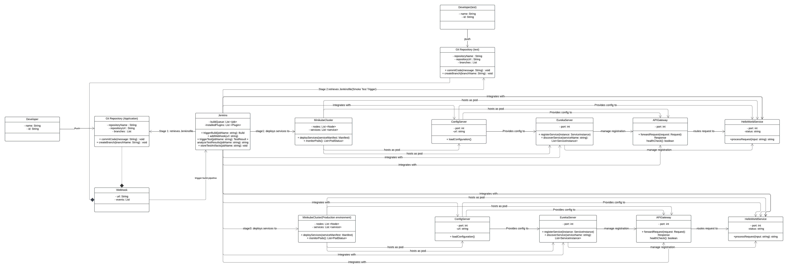
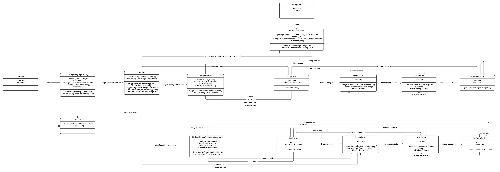

# CI/CD with GitOps

## Design Requirement Specification Document

DIBRIS – Università di Genova. Scuola Politecnica, Corso di Ingegneria del Software 80154

<!-- 
 <b> Authors </b>   AA   BB  
 -->

### REVISION HISTORY

Version | Data | Author(s)| Notes
---------|------|--------|------
1 | 31/05/2024 | Farshad Moradi Shahrbabak | First Version of the documen(Introduction, Project Description, System Overview)
1.1 | 01/06/2024 | Farshad Moradi Shahrbabak | Purpose and Scope, Bibliography, GitOps Architecture, System Data(System Inputs , system Outputs)
1.2 | 15/06/2024 | Farshad Moradi Shahrbabak | Technologies used, System Overview, System Architecture (v1), System Interfaces, System Inputs, System Ouputs
1.3 | 16/06/2024 | Farshad Moradi Shahrbabak | Class diagram(v1) , Object diagram(v1) , Dynamic Models (v1)
1.4 | 20/07/2024 | Farshad Moradi Shahrbabak | Class diagram (v2) |
1.5 | 20/07/2024 | Farshad Moradi Shahrbabak | Object diagram (v2) |
1.6 | 21/07/2024 | Farshad Moradi Shahrbabak | Dynamic Model (v2) |
1.7 | 21/07/2024 | Farshad Moradi Shahrbabak | System Architecture (v2) |
1.8 | 24/11/2024 | Farshad Moradi Shahrbabak | Technologies used(v2), System Overview(v2), modification to the overall document|
1.9 | 22/12/2024 | Farshad Moradi Shahrbabak | Class diagram (v3)|
2.0 | 25/12/2024 | Farshad Moradi Shahrbabak | Object diagram (v3)|

## Table of Content

- [CI/CD with GitOps](#cicd-with-gitops)
  - [Design Requirement Specification Document](#design-requirement-specification-document)
    - [REVISION HISTORY](#revision-history)
  - [Table of Content](#table-of-content)
  - [1 Introduction](#1-introduction)
    - [ 1.1 Purpose and Scope](#11-purpose-and-scope)
    - [ 1.2 Definitions](#12-definitions)
    - [ 1.3 Document Overview](#13-document-overview)
    - [ 1.4 Bibliography](#14-bibliography)
  - [ 2 Project Description](#2-project-description)
    - [ 2.1 Project Introduction](#21-project-introduction)
    - [ 2.2 Technologies used](#22-technologies-used)
    - [ 2.3 Assumption and Constraint](#23-assumption-and-constraint)
  - [  3 System Overview](#3-system-overview)
    - [  3.1 System Architecture](#31-system-architecture)
    - [  3.2 System Interfaces](#32-system-interfaces)
    - [  3.3 System Data](#33-system-data)
      - [  3.3.1 System Inputs](#331-system-inputs)
      - [  3.3.2 System Ouputs](#332-system-ouputs)
  - [4 CI/CD with GitOps](#4-ci/cd-with-gitops)
    - [4.1 Structural Diagrams](#41-structural-diagrams)
      - [4.1.1 Class diagram](#411-class-diagram)
        - [4.1.1.1 Class Description](#4111-class-description)
      - [4.1.2 Object diagram](#412-object-diagram)
      - [4.2 Dynamic Models](#42-dynamic-models)

## 1 Introduction

    
 The aim of implementing CI/CD is to automate the process of integrating, testing, and deploying code changes, ensuring faster, more reliable, and more frequent software releases with high quality and minimal manual intervention.

   Continuous Integration (CI) and Continuous Deployment (CD) are key practices in modern software development that streamline the process of delivering code changes more frequently and reliably. Together, they form the CI/CD pipeline, which automates the steps between writing code and deploying it to production.

### 1.1 Purpose and Scope

    
 This document outlines the design specifications for implementing GitOps within our continuous integration and continuous deployment (CI/CD) pipeline 

<h3>purpose:</h3> 
The purpose of implementing GitOps is to manage infrastructure and application deployments using Git as a single source of truth, enabling automated, consistent, and auditable workflows for continuous delivery and operations.

<h3>Scope:</h3> 
The scope of implementing GitOps includes automating the deployment, management, and monitoring of infrastructure and applications using version-controlled repositories, ensuring consistent and reproducible environments across all stages of the development lifecycle.

Source Code Management:

Integrate Git repositories to serve as the single source of truth for both application and infrastructure code.
Enable version control, collaboration, and audit trails through pull requests, commits, and branches.
Automated Build and Test:

Set up CI pipelines to automatically build and test code upon commits.
Ensure that unit tests, integration tests, and other quality checks are automated and consistently applied.
Containerization:

Use Docker to containerize applications, ensuring consistent runtime environments.
Create and manage Docker images that include all necessary dependencies.
Configuration Management:

Manage infrastructure and application configurations declaratively through Git repositories.
Use tools like Kubernetes and Helm for defining and deploying configurations.
Continuous Deployment:

Implement CD pipelines to automate the deployment of applications to various environments (development, staging, production).
Ensure that deployments are triggered automatically upon successful builds and tests.
Orchestration and Infrastructure Management:

Use Kubernetes for container orchestration, ensuring applications are deployed, managed, and scaled efficiently.
Implement GitOps principles to manage Kubernetes manifests and Helm charts through Git.
Monitoring and Logging:

Set up monitoring and logging tools to track application performance, health, and logs.
Ensure that logs and metrics are accessible and actionable, enabling rapid troubleshooting and performance optimization.
<!-- Security and Compliance: -->

<!-- Implement security best practices within the CI/CD pipeline, such as vulnerability scanning and compliance checks.
Ensure that access controls and audit trails are in place for all GitOps processes.
Rollback and Disaster Recovery:

Define rollback procedures to quickly revert to previous versions in case of deployment failures.
Implement backup and recovery strategies for both application data and configurations.
Documentation and Training:

Provide comprehensive documentation for all CI/CD and GitOps processes.
Conduct training sessions for team members to ensure they understand and can effectively use the CI/CD pipeline and GitOps workflows. -->
Scalability and Performance Optimization:

Design the CI/CD pipeline and GitOps processes to handle increasing workloads and scaling requirements.
Optimize performance of the CI/CD pipeline to ensure fast and efficient builds, tests, and deployments.

### 1.2 Definitions

    
 Put a summary of the section 

    
This sub section should describe ...

| First Header  | Second Header |
| ------------- | ------------- |
| Content Cell  | Content Cell  |
| Content Cell  | Content Cell  |

### 1.3 Document Overview

    
 Explain how is organized the document
    

    
This sub section should describe ...

### 1.4 Bibliography

    
This section includes references to all sources of information that already is available for us

Book: 

Article: 

Website:
<a href="https://www.jenkins.io/doc/tutorials/">Jenkins Tutorials (Official Documentation)</a>
<a href="https://hub.docker.com/r/jenkinsci/jenkins">Jenkins Continuous Integration and Delivery server(Docker)</a>
<a href="https://minikube.sigs.k8s.io/docs/start/?arch=%2Fwindows%2Fx86-64%2Fstable%2F.exe+download">MiniKube</a>

##  2 Project Description

###  2.1 Project Introduction

    
 The primary objective of the GitOps project and propose a potential solution at a high level.
    

    
This project assumes:  
 • to use a microservice framework (SpringBoot) to implement a reference java
application. This application must be composed by a few microservices and must be
used as reference to apply the CI/CD pipeline based on GitOps paradigm. 
 • Some test cases must be implemented to validate the application. These test cases
must define the Smoke Tests executed during the CI/CD pipeline to validate the
application before installing in the production environment 
 • A production environment where release the application and make this available for the
custome

### 2.2 Technologies used

 Description of the overall architecture. 

<!--  -->
| name          | Description |
| ------------- | ------------- |
| Github        | GitHub is a web-based platform for version control and collaborative software development, allowing users to host and review code, manage projects, and build software alongside millions of developers worldwide.  |
| Jenkins   | Jenkins is an open-source automation server used for continuous integration and continuous delivery (CI/CD) to build, test, and deploy software projects efficiently. |
| Java(Spring Framework)  | Java's Spring Framework is a powerful, lightweight framework for building enterprise-level applications, offering features like dependency injection, aspect-oriented programming, and seamless integration with various technologies|
| Docker  | Docker is an open-source platform that automates the deployment and management of applications within lightweight, portable containers, ensuring consistent environments across different stages of development and production.|
| MiniKube   | Minikube is a tool that enables running a single-node Kubernetes cluster locally on your machine, making it easy to develop and test Kubernetes applications. |
| Python  | Python is a versatile, high-level programming language known for its simplicity, readability, and wide range of libraries, making it ideal for tasks ranging from web development  |

### Github
GitHub is a popular platform that enables developers to manage, track, and collaborate on their projects. Using GitHub, developers can commit and push Java or Python files to different repositories to save their changes and maintain version control

### Jenkins
After developers push their code to a GitHub repository, webhooks can be configured to trigger automated processes. In this setup, GitHub sends a notification to Jenkins through a webhook whenever a push event occurs. This webhook integration allows Jenkins to automatically start a build or deployment pipeline, ensuring continuous integration and delivery (CI/CD).
By using this approach, the workflow becomes more efficient and less prone to delays, as developers do not need to manually trigger Jenkins jobs. Instead, Jenkins listens for the webhook, retrieves the latest code changes, and executes predefined tasks such as testing, building, or deploying the application. This automation streamlines the development process and helps maintain a robust and consistent project pipeline.

### Java(Spring Framework)
Using the Java programming language and the Spring Framework, we can create a microservices architecture with four essential components:

Service Registry: Built with Spring Cloud Netflix Eureka, the Service Registry enables dynamic discovery of microservices, allowing them to register themselves and communicate seamlessly without hardcoded endpoints.

Config Server: Utilizing Spring Cloud Config, the Config Server centralizes configuration management, providing a single source of truth for application settings across all microservices, ensuring consistency and reducing duplication.

API Gateway: Implemented using Spring Cloud Gateway, the API Gateway acts as a unified entry point to the system, handling tasks such as routing, load balancing, and authentication for requests across microservices.

Hello World Microservice: A simple microservice created with Spring Boot to demonstrate the architecture, this service handles a basic "Hello World" response, showcasing the ease of deploying and scaling functionality within the framework.

Together, these microservices demonstrate how the Spring Framework simplifies the creation of scalable, maintainable, and efficient distributed systems.

### Docker
To streamline the deployment of the microservices, Docker can be used to containerize each component. Docker allows us to package the microservices (Service Registry, Config Server, API Gateway, and Hello World Microservice) along with their dependencies and runtime environment into lightweight containers. Here's how Docker is utilized:

Dockerizing Microservices:
Each microservice is equipped with a Dockerfile that specifies the base image (e.g., OpenJDK for Java), dependencies, and the commands to build and run the microservice.
These Dockerfiles ensure that the microservices can run consistently across any environment, eliminating issues caused by differences in configurations or operating systems.

Building Images:
The docker build command is used to create Docker images for each microservice from their respective Dockerfile.
These images encapsulate the application's code, libraries, and configurations.

Running Containers:
Each Docker image is deployed as a container using the docker run command, ensuring isolated environments for each microservice.
Containers can be linked to enable communication between the microservices, such as the API Gateway accessing the Hello World Microservice.

Orchestrating with Docker Compose:
A docker-compose.yml file can be created to define and manage all the microservices. This file specifies how containers should be networked, their environment variables, and any dependencies.

Running docker-compose up will start all the microservices together, simplifying deployment and ensuring they interact seamlessly.
By using Docker, we achieve a portable, consistent, and scalable deployment process for the microservices, making it easier to develop, test, and deploy the system across different environments.

### Minikube
Minikube is a lightweight Kubernetes implementation that runs on a local machine, making it an excellent environment for testing and deploying microservices during development. By using Minikube, the microservices can be deployed and tested in a controlled Kubernetes environment directly on a local machine. This approach ensures the services are production-ready and simplifies troubleshooting before moving to a larger-scale deployment.

### Python
To ensure the microservices are correctly deployed and running in the Minikube environment, we can use Python to write a simple test script. This script verifies that each microservice is operational by sending HTTP requests to their endpoints and checking the responses. Here's how Python can be utilized:

Setup:
The test script uses libraries like requests to send HTTP requests and unittest or pytest for structuring and executing the tests.

Testing Endpoints:
The script sends HTTP requests to the endpoints exposed by the microservices (e.g., the API Gateway or Hello World Microservice) running in the Minikube environment.
It checks for expected responses, such as "Hello World" from the Hello World Microservice or a status code of 200 OK from the API Gateway.

Environment Validation:
The script ensures that the Service Registry and Config Server are reachable and functioning correctly. It validates that the microservices are registered in the Service Registry and can communicate as expected.

Automated Execution:
The test script can be integrated into the CI/CD pipeline, automatically running after deployment in Minikube to confirm the system's health. It can output detailed logs indicating which services passed or failed the tests, aiding in debugging if issues arise.

###  2.3 Assumption and Constraint

    
 Constraints of the project implementation
 

    

    1-There isn't any cloud server (like AWS) available for running Docker and Jenkins, so they must be run on the local machine  
    

## 3 System Overview

    
 Users should be able to build, test, and deploy their code by simply pushing it to the repository as an input. Here we show the use case diagram and some of the scenarios that must be implemented.
    

| Use Case      | 1.0           |
| ------------- | ------------- |
| Name          | GitOps flow       |
| Actors        | Generic User  |
| Entry Point   | (1) .Java files  |
| Exit  Point   | (4) File to be deployed|
| Event Flow    | (1) User invoke the system by pushing the program.   (2) buildimage is triggered. This job is responsible for building a Docker container image from the code in the kubernetecode repository.   (3) Another CI job called updatemanifest is triggered. This job updates the deployment.yaml file in a separate GitHub repository named kubernetesmanifest.   (4) The updated deployment.yaml file is automatically picked up |

# GitOps Flow
GitOps is a methodology that uses Git as a single source of truth for declarative infrastructure and applications. It leverages Git repositories as the source of truth for the desired state of the system, automating deployment and operations tasks. Here's a detailed breakdown of the GitOps flow illustrated in the image:

1-Code Commit
Developer writes code and commits to the repository. A developer writes or updates code  within a repository on GitHub. The commit to GitHub triggers the CI/CD pipeline to start the build process.

2-Build Docker Image:
Job - buildimage: This job is responsible for building the Docker container image from the committed code.
The Docker image is tagged with a version, for example, test:10.

3-Deploy to Kubernetes Cluster : If all tests pass successfully in the test environment (Kubernetes environment), deploy the application to the production environment using the Greenfield approach. This ensures the application is installed on a clean setup without any previous versions running.

# Detailed Steps in the Flow
Step-by-Step Explanation:

1-Code Commit by Developer:
A developer makes changes to the application code and commits these changes to the GitHub repository.
GitHub triggers a webhook to initiate the CI/CD pipeline.

2-Clone the Repository
The pipeline starts by downloading the project’s code from a GitHub repository. This ensures that the pipeline works with the most up-to-date version of the code.

3-Start Minikube
This step ensures that Minikube, a tool for running Kubernetes locally, is clean and ready to use. It stops and deletes any existing Minikube environment and then starts a fresh instance. Minikube's settings are configured so that Docker commands in the pipeline build images directly inside Minikube’s environment.

4-Build Docker Images
The pipeline rebuilds all Docker images for the project, ensuring the latest version of the application and its dependencies are ready for deployment.

5-Deploy Services to Minikube
The application and its services are deployed to the Minikube environment using Kubernetes configuration files.

6-Run Smoke Tests
A separate automated test pipeline is triggered to verify that the deployed application is functioning correctly.

# Components and Their Roles

Developer:
Writes and commits code to the source repository.

GitHub:
Hosts the source code and the Kubernetes manifests in separate repositories.
Acts as the trigger point for CI/CD pipelines.

Jenkins:
Automates the build and update processes.
Builds Docker images and updates Kubernetes manifests.

Kubernetes Cluster:
Runs the deployed application.
Continuously maintains the desired state defined in the deployment configurations.

# Summary
This GitOps flow ensures that the entire process from code commit to deployment is automated and traceable via Git repositories. By using tools like Jenkins and Docker the flow ensures consistent, reliable, and auditable deployments to Kubernetes clusters. This approach enhances collaboration, improves deployment speed, and maintains system stability.

### 3.1 System Architecture

    
 GitOps Architecture

| Name      | Description         |
| ------------- | ------------- |
| Git Repository (Source Control)|Centralized storage for all code and configuration files.|
| CI/CD Pipeline| Automates the process of building, testing, and deploying applications |
| Container Registry| Stores container images built by the CI/CD pipeline.  |
|Kubernetes Cluster|Orchestrates and manages containerized applications.|
|GitOps Operator|Continuously synchronizes the Kubernetes cluster with the desired state defined in the Git repository.|
|Monitoring and Logging|Tracks the health, performance, and logs of applications and infrastructure.|
|Secrets Management|Manages sensitive data securely|
|Infrastructure as Code (IaC)|Defines and manages infrastructure resources through code.|

Git Repository (Source Control):
This is the central source of truth where all the code, configuration files, and infrastructure definitions are stored. GitHub is used for source control.
Function: Stores application code, Kubernetes manifests, Helm charts, and other configuration files.

CI/CD Pipeline:
A Continuous Integration and Continuous Deployment (CI/CD) pipeline automates the process of building, testing, and deploying applications.
Function:
Build & Test: Integrates and tests changes to ensure they are production-ready.
Store Images: Builds Docker images and pushes them to a container registry.

Container Registry
A repository for storing and distributing Docker container images.
Function: Stores the container images built by the CI/CD pipeline.

GitOps Operator:
The core component of a GitOps system. It monitors the Git repository for changes and synchronizes the desired state defined in the repository with the actual state of the Kubernetes cluster.
Function: Applies the Kubernetes manifests and Helm charts from the Git repository to the Kubernetes cluster.

Kubernetes Cluster:
The runtime environment where containerized applications are deployed and managed.
Function: Runs the applications, ensuring they match the desired state defined in the manifests stored in the Git repository.

Monitoring and Logging:

Tools and systems that provide visibility into the performance and health of the applications running in the Kubernetes cluster.
Function: Collects, aggregates, and visualizes logs and metrics from the applications and the infrastructure.

Secrets Management:
A system for securely storing and managing sensitive information such as API keys, passwords, and certificates.
Function: Ensures that secrets are securely stored and accessed by applications and infrastructure components as needed. Examples include HashiCorp Vault, AWS Secrets Manager, and Kubernetes Secrets.

Infrastructure as Code (IaC)
The practice of defining and managing infrastructure using code and automation tools.
Function: Allows the definition and provisioning of infrastructure using code, making the process repeatable, scalable, and consistent.

# Detailed Workflow

Presentation Layer:
Developer (Application)
Developer (Test)
This layer represents the users (developers) who are responsible for both the application and test code.
Application Layer:
Git Repository (Application)
Git Repository (Test)
Pipeline
This layer includes the version control system (Git repositories) where both application and test code are stored.
The pipeline represents the CI/CD (Continuous Integration/Continuous Deployment) processes that automate the building, testing, and deployment of the code.

Integration Layer:
Webhook
Docker Image
Docker Repository
Minikube
Live Server
Webhook: This component is used to trigger events in the pipeline, often when changes are made in the Git repository.
Docker Image: This represents the packaged application, which includes everything needed to run the application.
Docker Repository: This is where the Docker images are stored and managed.
Minikube: This is a tool that sets up a local Kubernetes cluster for development and testing purposes.
Live Server: This is the production environment where the application is deployed and accessible to end-users.

Data Layer:
There are no explicit data components in this layer, but the Minikube and Live Server are mentioned as being part of this layer because they are deployment environments that manage the application's data.

#### Flow of Components:
Developers push code to the Git Repositories (Application/Test).
Changes in the Git repositories trigger the Pipeline.
The Pipeline builds the application and creates a Docker Image.
The Docker Image is pushed to the Docker Repository.
The Webhook can trigger additional actions in the pipeline.
The Docker Image is deployed to Minikube for testing or directly to the Live Server for production deployment.
This structure ensures that the application code is continuously integrated and deployed in an automated manner, promoting a seamless and efficient workflow from development to production.

# Benefits of GitOps Architecture

1) Single Source of Truth:
The Git repository serves as the single source of truth for both application code and infrastructure configuration, ensuring consistency and traceability.

2) Automated Deployments:
Changes committed to the Git repository automatically trigger deployment processes, reducing manual intervention and errors.

3) Version Control:
Git provides robust version control, enabling rollbacks and detailed audit trails of changes.

4) Increased Security:
Secrets management ensures sensitive information is handled securely.
GitOps promotes secure and auditable change management practices.

5) Improved Observability:
Integrated monitoring and logging provide comprehensive visibility into the system’s health and performance.

6) Scalability and Repeatability:
Infrastructure as Code (IaC) and automated pipelines ensure that infrastructure and applications can be scaled and replicated consistently across environments.

# Summary
This GitOps architecture enhances collaboration, improves deployment speed, and ensures the stability and security of applications running in a Kubernetes environment. By leveraging Git as the source of truth and automating the entire deployment pipeline, organizations can achieve a highly efficient and reliable deployment process.

### 3.2 System Interfaces

    
 Interfaces that exist in GitOps management include Git repositories for version control, CI/CD tools like Jenkins for automation, Docker for containerization, and Kubernetes for orchestration. These interfaces work together to automate and streamline the deployment and management of applications and infrastructure.
    

| Name      | Interfaces in GitOps Management |
| ------------- | ------------- |
|  Git Repositories          | Displays repositories, recent activity, and notifications ,  Lists files, directories, and their history within the repository , Allows users to review, comment, and approve changes before they are merged , hows the history of commits and the different branches within the repository.|
| Jenkins       | Provides an overview of all jobs, build statuses, and pipelines, Details for each job or pipeline, including build history, logs, and configuration options ,  Real-time and historical logs for each build, showing the steps executed and their outcomes , Interfaces for setting up and managing jobs, pipelines, credentials, and plugins , Visualization of test results, code coverage, and build metrics.|
| Docker   | Summary of container status, images, and repositories , Lists available images, tags, and details about each image , Shows running containers, their statuses, logs, and resource usage , Allows users to search and pull images from Docker Hub or other registries.|
|Kubernetes    | Overview of cluster status, nodes, namespaces, and workloads,  Lists deployments, pods, replica sets, and services, showing their status and resource usage ,Displays information about cluster nodes, including health, capacity, and performance metrics.|

1. Git Repository Interface
Purpose: Acts as the source of truth for both application code and infrastructure configurations.
Components:
GitHub: Popular platform for hosting Git repositories.
Files and Directories: Contain application code, Kubernetes manifests, Helm charts, and Infrastructure as Code (IaC) files.
Functions:
Version Control: Tracks changes to files, enabling rollbacks and maintaining a history of changes.
Collaboration: Facilitates collaboration through pull requests, code reviews, and comments.
Triggering CI/CD Pipelines: Commits and merges to specific branches can trigger CI/CD pipelines.

2. CI/CD Pipeline Interface
Purpose: Automates the build, test, and deployment processes.
Components:
Jenkins: CI/CD tools that orchestrate automated workflows.
Build Scripts: Define the steps for building and testing the application.
Configuration Files: Such as .travis.yml, Jenkinsfile, etc., which define the CI/CD pipeline stages.
Functions:
Building: Compiles the application code and builds Docker images.
Testing: Runs automated tests to ensure code quality.
Deploying: Pushes Docker images to container registries and updates manifests in the Git repository.

3. Container Registry Interface
Purpose: Stores and distributes Docker images.
Components:
Docker Hub/Amazon ECR/Google Container Registry: Services for storing Docker images.
Image Tags: Identify specific versions of Docker images.
Functions:
Storing Images: Keeps built Docker images ready for deployment.
Versioning: Uses tags to manage different versions of images.
Pulling Images: Kubernetes clusters pull images from the registry based on the tags specified in deployment manifests.

4. GitOps Operator Interface
Purpose: Monitors the Git repository for changes and synchronizes the desired state with the Kubernetes cluster.
Components:
Synchronization Mechanism: Watches the Git repository and applies changes to the cluster.
Functions:
Syncing: Detects changes in the Git repository and updates the Kubernetes cluster to match the desired state.
Reconciliation: Continuously ensures that the actual state of the cluster matches the desired state defined in the Git repository.
Rollback: Provides mechanisms to revert to previous states if issues are detected.

5. Kubernetes Cluster Interface
Purpose: Executes and manages containerized applications.
Components:
API Server: The core interface to interact with the Kubernetes cluster.
Kubelet: Runs on each node and manages containers.
Kubectl: Command-line tool to interact with the Kubernetes cluster.
Functions:
Deploying Applications: Runs containers based on the manifests defined in the Git repository.
Scaling: Automatically adjusts the number of running instances based on demand.
Self-healing: Automatically restarts failed containers and reschedules them on healthy nodes.

6. Monitoring and Logging Interface
Purpose: Provides visibility into the health and performance of applications and infrastructure.
Components:
minikube: For metrics collection and visualization.
Functions:
Collecting Metrics: Gathers performance and usage metrics from the cluster and applications.
Aggregating Logs: Collects and stores logs for analysis and troubleshooting.
Visualizing Data: Provides dashboards and visual representations of metrics and logs.
Alerting: Sends alerts based on predefined conditions or thresholds.

7. Infrastructure as Code (IaC) Interface
Purpose: Defines and manages infrastructure using code.
Components:
Terraform: Tools for IaC.
Configuration Files: Define infrastructure resources and their dependencies.
Functions:
Provisioning: Automatically sets up and configures infrastructure.
Versioning: Tracks changes to infrastructure configurations, enabling rollbacks.
Automation: Reduces manual intervention by automating infrastructure setup and management.
Interaction and Workflow

1. Development and Commit
Developers make changes to application code and infrastructure configurations, committing these changes to the Git repository.
2. Triggering CI/CD Pipeline
The commit triggers the CI/CD pipeline, which builds the application, runs tests, and stores the Docker images in the container registry.
3. Updating Manifests
The pipeline updates Kubernetes manifests in the Git repository to reference the new Docker image versions.
4. GitOps Operator Sync
The GitOps operator detects changes in the Git repository and synchronizes the Kubernetes cluster with the updated manifests.
5. Deployment and Monitoring
The Kubernetes cluster deploys the updated applications. Monitoring and logging systems collect metrics and logs, providing visibility and alerting on the system's health and performance.
6. Secret Management and IaC
Secrets management ensures sensitive data is securely handled. IaC tools provision and manage infrastructure resources as defined in the code.

# Benefits of GitOps Interfaces
Consistency and Traceability: All changes are version-controlled in Git, providing a clear history and audit trail.
Automation and Efficiency: Automates the build, test, and deployment processes, reducing manual errors and speeding up delivery.
Scalability: Easily scales infrastructure and applications by defining configurations in code.
Security: Manages secrets securely and ensures access control policies are enforced.
Observability: Provides comprehensive monitoring and logging, ensuring issues are detected and resolved quickly.
Collaboration: Facilitates collaboration among teams through Git workflows, pull requests, and code reviews.
This comprehensive explanation outlines the critical interfaces in GitOps management, detailing their roles, components, and interactions within the GitOps workflow, ensuring a robust, secure, and efficient deployment process.

### 3.3 System Data

    
 In this section we describe the inputs and outputs as well as their format.
    

    
By clearly defining the inputs and outputs at each stage of the GitOps CI/CD process, the workflow ensures a streamlined and automated approach to building, testing, and deploying applications. This results in consistent, reliable, and efficient software delivery.

#### 3.3.1 System Inputs

    
 System Inputs

| Name|Description|
| ------------- | ------------- |
|Source Code|The primary input is the application code that developers write and maintain.(Developers commit their code to a version-controlled repository (e.g., GitHub, GitLab)) |
|Configuration Files|These include YAML or JSON files that define the desired state of the infrastructure and applications(Jenkinsfile)|
|Dockerfiles| These include YAML or JSON files that define the desired state of the infrastructure and applications.|
|Test Scripts|Scripts and configurations for automated testing, including unit tests, integration tests, and end-to-end tests.|
|Secrets and Environment Variables|Sensitive information and configuration settings required by the application.|

# Detailed Workflow of CI/CD Inputs

### Code Check-in and Version Control
Input: Source Code
Process: Developers write code and commit changes to a version control system (VCS) like Git. Each commit or pull request triggers the CI/CD pipeline.
Tools: GitHub

### Build Configuration
Input: Configuration Files, Dependency Files
Process: The pipeline uses build configuration files (e.g., Jenkinsfile) to define the build steps. Dependency files ensure all required libraries and tools are installed.
Tools: Jenkins

### Automated Testing
Input: Test Data and Test Cases
Process: The pipeline runs automated tests using the provided test data and test cases. This step verifies that the application functions correctly and meets quality standards.
Tools: JUnit, pytest, Selenium.

### Containerization
Input: Docker Images and Containers
Process: The pipeline builds Docker images using a Dockerfile and pushes these images to a container registry. These images are then used to deploy the application.
Tools: Docker, Docker Hub

### Deployment
Input: Configuration Files, Docker Images
Process: The deployment stage reads the deployment configuration files (e.g., k8s-deployment.yaml) and uses them to deploy the application containers to the target environment.
Tools: Kubernetes

### Monitoring and Logging
Input: Metrics and Logging Configurations
Process: Monitoring and logging tools collect and process logs and metrics during and after the deployment. This helps in tracking the application's performance and diagnosing issues.
Tools:minikube

#### 3.3.2 System Ouputs

    
 System Ouputs

| Name|Description|
| ------------- | ------------- |
|Built Artifacts|Compiled and packaged versions of the application, in the form of Docker images.|
|Deployment Manifests|Updated configuration files that specify the desired state of the application in the Kubernetes cluster.|
|Deployed Applications|Running instances of the application within the Kubernetes cluster.|
|Logs and Metrics|Output from application and infrastructure monitoring tools, including performance metrics, logs, and alerts.|
|Test Reports| Results from automated tests, providing feedback on the code quality and functionality.|

# Key System Outputs in CI/CD

### Build Artifacts
Description: These are the compiled, packaged, and ready-to-deploy versions of the application.
Components: Executable binaries, JAR files, WAR files, Docker images.
Purpose: Serve as the deployable version of the application, created from the source code and ready to be tested and deployed.

### Docker Images
Description: Containerized versions of the application, encapsulated with all dependencies and configurations.
Components: Docker image files stored in a container registry.
Purpose: Ensure consistency across different environments by running the same containerized application in development, testing, and production environments.

### Test Reports and Results
Description: Detailed results of automated tests run during the pipeline execution.
Components: Unit test results, integration test results, end-to-end test results, coverage reports.
Purpose: Provide insights into the quality of the code, highlighting any issues or failures that need to be addressed before deployment.

### Deployment Manifests
Description: Configuration files that define how the application should be deployed in different environments.
Components: Kubernetes manifests (deployment.yaml), Helm charts, Terraform files.
Purpose: Automate and standardize the deployment process, ensuring that the application is deployed consistently across environments.

### Logs and Audit Trails
Description: Detailed logs of the CI/CD pipeline execution, including steps performed, success and failure messages, and timestamps.
Components: Build logs, deployment logs, audit logs.
Purpose: Provide traceability and accountability, allowing developers and operators to troubleshoot issues and understand the history of changes.

### Monitoring Data and Metrics
Description: Metrics and data collected from the application and infrastructure during and after deployment.
Components: Performance metrics, resource usage, health checks.
Purpose: Monitor the health and performance of the application, ensuring that it meets the required standards and operates reliably.

### Notifications and Alerts
Description: Automated alerts and notifications sent to stakeholders about the status of the pipeline and deployed application.
Components: Email notifications.
Purpose: Keep stakeholders informed about the build, test, and deployment status, as well as any issues that require immediate attention.

## 4 CI/CD with GitOps

    
Here we describe the structure of the system.

    
First we describe the Static structure of the system, such as the Class/Object Diagram, and then we describe the dynamic behavior of the system.

### 4.1 Structural Diagrams

    
 Here we describe two different types of view of the system, class, and Object Diagram
    

    

#### 4.1.1 Class diagram

    
 class diagram with the types of attributes and methods included for a CI/CD system integrated with GitOps
    

##### 4.1.1.1 Class Description

    
Class Description

This class diagram defines a comprehensive CI/CD pipeline and microservices ecosystem, emphasizing automation, configuration management, and scalability.

### Components and Classes
##### 1. Developer
Represents the user or engineer responsible for pushing changes (code or tests) to the system.
Attributes:
name: String: The name of the developer.
id: String: A unique identifier for the developer.
Relationships:
The Developer pushes changes to the Git Repository (application or test).

##### 2. Git Repository
Represents the version control system where code and test files are stored.
Application Repository:
Stores application source code.
Attributes:
repositoryName: String: Name of the repository (e.g., app-repo).
repositoryUrl: String: URL for accessing the repository.
branches: List: A list of branches (e.g., main, feature-branch).
Methods:
commitCode(message: String): void: Commits code to the repository with a commit message.
createBranch(branchName: String): void: Creates a new branch.
Test Repository:
Stores test files and scripts.
Attributes and methods are similar to the application repository.

##### 3. Webhook
Acts as a listener for events in the Git Repository, such as push or commit.
Attributes:
url: String: The endpoint that receives the event notification.
events: List: The list of events that trigger the webhook (e.g., push, commit).
Relationships:
The Webhook notifies Jenkins to initiate the pipeline when a relevant event occurs in the repository.

##### 4. Jenkins
A CI/CD server that automates testing, building, and deployment of code.
Attributes:
buildQueue: List<job>: A queue of build jobs waiting to execute.
installedPlugins: List<Plugin>: A list of plugins installed in Jenkins (e.g., Git, Docker).
Methods:
triggerBuild(jobName: String): Build: Triggers a build for a specified job.
addWebhook(url: String): void: Configures a webhook in Jenkins.
triggerTest(jobName: String): TestResult: Executes tests as part of a pipeline.
analyzeTestResults(jobName: String): String: Analyzes the results of executed tests.
storeTestArtifacts(jobName: String): void: Stores the artifacts generated during a build or test.
Relationships:
Jenkins interacts with the MinikubeCluster to deploy services to different environments.

##### 5. MinikubeCluster
Represents a Kubernetes-based cluster used for deploying and managing services.
Attributes:
nodes: List<Node>: The nodes that make up the cluster.
services: List<Service>: The services running in the cluster.
Methods:
deployServices(serviceManifest: Manifest): void: Deploys services using a Kubernetes manifest file.
monitorPods(): List<PodStatus>: Monitors the status of pods running in the cluster.
Instances:
Staging Cluster: Used for testing and validating deployments.
Production Cluster: Used for deploying production-ready services.

##### 6. ConfigServer
Provides dynamic configurations to microservices running in the cluster.
Attributes:
port: int: The port on which the server runs.
url: String: The URL for accessing the configuration server.
Methods:
loadConfiguration(): Supplies configuration settings to services in real-time.
Relationships:
ConfigServer integrates with MinikubeCluster and provides configurations to other components like HelloWorldService.

##### 7. EurekaServer
A service discovery server that allows microservices to register and discover each other.
Attributes:
port: int: The port on which the server runs.
Methods:
registerService(instance: ServiceInstance): void: Registers a new service instance with Eureka.
discoverService(serviceName: String): List<ServiceInstance>: Retrieves all registered instances of a specific service.
Relationships:
EurekaServer is hosted in the MinikubeCluster and provides service discovery capabilities to microservices like HelloWorldService and APIGateway.
##### 8. APIGateway
Serves as the entry point for client requests and routes them to the appropriate microservices.
Attributes:
port: int: The port used for routing requests.
Methods:
forwardRequest(request: Request): Response: Routes client requests to backend services.
healthCheck(): boolean: Performs health checks to ensure services are functional.
Relationships:
The API Gateway interacts with the HelloWorldService and uses EurekaServer for service discovery.
##### 9. HelloWorldService
Represents a microservice hosted in the cluster.
Attributes:
port: int: The port on which the service runs.
status: String: The status of the service (e.g., active, inactive).
Methods:
processRequest(input: String): String: Handles client requests and returns a response.
Relationships:
HelloWorldService registers itself with EurekaServer and receives configurations from ConfigServer.

### Process Explanation

#### Stage 1: Build/Deployment to MinikubeCluster(Testing environment):

1. The developer pushes new code to the Git repository.
The repository detects the push event and triggers the webhook.(It doesn't make a difference which developer (application developer or test script developer) pushes code into either repository (application or test); the pipeline will trigger regardless)

2. The webhook sends a request to its configured URL with details about the event (e.g., the updated branch or commit).

3. The webhook triggers the Jenkins pipeline, initiating processes such as code testing, building, or deployment.

4. Jenkins deploys services to the staging MinikubeCluster by utilizing the deployServices() method.
The services are monitored using monitorPods().

5. Registration:
The ConfigServer provides necessary configurations to services deployed in Minikube.
Services (e.g., HelloWorldService) register with the EurekaServer for discovery.

#### Stage 2: Trigger Smoke Testing

6. Jenkins receives the webhook notification and identifies the appropriate pipeline job to run.
The Jenkinsfile from the repository is retrieved (if required), and the pipeline for smoke testing is triggered. The smoke test job is responsible for validating the basic functionality of the application or services to ensure the code changes (test scripts) do not break core features.

#### Stage 3: Deployment to MinikubeCluster (Production):

7. After successful testing and verification, Jenkins triggers deployment to the production MinikubeCluster.
Configuration and service registration processes repeat for the production environment.

8. Request Routing:
The API Gateway routes incoming client requests to the appropriate service, such as HelloWorldService.
EurekaServer assists in service discovery during this process.

#### 4.1.2 Object diagram

    
 snapshot of the system at a particular point in time, showing the instances of classes (objects) and their relationships. While class diagrams show the static structure of the system, object diagrams illustrate the actual data and its interactions during runtime.
    

##### 1. Developer
Represents the individuals who push code or test scripts to their respective repositories.
Attributes:
name: String: The name of the developer.
id: String: A unique identifier for the developer.
Objects:
Developer for application: Alice (dev001).
Developer for test scripts: Bob (test001).
Relationships:
Developers push code or test scripts to Git Repositories.

##### 2. Git Repository
Represents repositories used to store application code and test scripts.
Application Repository:
Attributes:
repositoryName: String: The name of the repository (e.g., sales-app).
repositoryUrl: String: The URL for accessing the repository.
branches: List: The branches in the repository (e.g., main, jenkins-setup).
Methods:
commitCode(message: String): Allows developers to commit changes to the repository.
createBranch(branchName: String): Creates a new branch in the repository.
Test Repository:
Stores the test scripts used during the CI/CD pipeline.
Attributes and methods are similar to the application repository.
Objects:
Git Repository (Application):
Name: se24-p08.
URL: https://github.com/mnarizzano/se24-p08.
Branches: [main, feature, jenkins-setup].
Git Repository (Test):
Name: CI-CD-With-GitOps_SmokeTestsFiles.
URL: https://github.com/mainrepo/smoke-tests.git.
Branches: [main].

##### 3. Webhook
Listens for events (e.g., push) in the repositories and triggers the pipeline in Jenkins.
Attributes:
url: String: The endpoint URL for the webhook.
events: List: The list of events that the webhook listens for (e.g., push).
Object:
URL: http://localhost:7777/jenkins-webhook.
Events: [push].

##### 4. Jenkins
Represents the CI/CD server responsible for automating the pipeline, including testing and deployment.
Attributes:
buildQueue: List<job>: A list of jobs queued for execution.
installedPlugins: List<Plugin>: Plugins installed in Jenkins (e.g., GitPlugin, DockerPlugin).
Methods:
triggerBuild(jobName: String): Triggers a build for the given job.
addWebhook(url: String): Configures a webhook for Jenkins.
triggerTest(jobName: String): Executes test jobs in Jenkins.
analyzeTestResults(jobName: String): Analyzes the results of the tests.
storeTestArtifacts(jobName: String): Stores artifacts generated during the build or test.
Objects:
Build Jobs:
deploy-smoke-test-job.
staging-deployment-job.
Relationships:
Jenkins integrates with MinikubeCluster to deploy services to staging and production environments.

##### 5. MinikubeCluster
Represents Kubernetes clusters used for deploying and managing services.
Attributes:
nodes: List<Node>: A list of nodes in the cluster.
services: List<Service>: Services running in the cluster.
Methods:
deployServices(serviceManifest: Manifest): Deploys services to the cluster using a Kubernetes manifest.
monitorPods(): List<PodStatus>: Monitors the status of the pods in the cluster.
Objects:
Staging Cluster:
Nodes: [Node1, Node2].
Services: ConfigServerInstance, EurekaServerInstance, HelloWorldServiceInstance.
Production Cluster:
Nodes: [Node3, Node4].
Services: Same as staging cluster.
Relationships:
Hosts the microservices (ConfigServer, EurekaServer, HelloWorldService).

##### 6. ConfigServer
Provides configuration management for microservices.
Attributes:
port: int: The port on which the server runs.
url: String: The URL for accessing the configuration server.
Methods:
loadConfiguration(): Supplies configuration dynamically to services.
Object:
URL: http://localhost:8888.
Port: 8888.
Relationships:
Provides configuration to EurekaServer and other services.

##### 7. EurekaServer
Handles service discovery for microservices, allowing them to register and discover each other.
Attributes:
port: int: The port for accessing the Eureka server.
Methods:
registerService(instance: ServiceInstance): Registers a service instance with the Eureka server.
discoverService(serviceName: String): Discovers registered services by name.
Object:
Port: 8761.
Relationships:
Manages the registration and discovery of microservices like HelloWorldService.

##### 8. APIGateway
Acts as the entry point for client requests, routing them to the appropriate services.
Attributes:
port: int: The port on which the gateway runs.
Methods:
forwardRequest(request: Request): Routes requests to services.
healthCheck(): Performs health checks for the services.
Object:
Port: 8080.
Relationships:
Communicates with EurekaServer for service discovery and routes requests to HelloWorldService.

##### 9. HelloWorldService
Represents an example microservice deployed in the cluster.
Attributes:
port: int: The port on which the service runs.
status: String: The current status of the service (e.g., active).
Methods:
processRequest(input: String): Processes a request from the client.
Object:
Port: 8081.
Status: active.
Relationships:
Registers itself with EurekaServer.
Receives configurations from ConfigServer.

### Process Explanation

1. Developers (Alice and Bob) push changes to application or test repositories.
2. Webhook detects push events and triggers Jenkins pipelines.
3. Jenkins runs smoke tests and deploys services to MinikubeCluster (staging or production).
4. ConfigServer and EurekaServer manage configurations and service discovery for microservices.
5. APIGateway routes client requests to the backend service, HelloWorldService.

#### 4.2 Dynamic Models

    
 The dynamic model of a CI/CD system provides a comprehensive view of the interactions and behaviors within the system over time 

    

This sequence diagram illustrates a typical CI/CD (Continuous Integration/Continuous Deployment) pipeline. Here’s an explanation of each component and step involved in the process:

Developer: The process begins with the developer writing code and pushing it to the Git repository.

Git Repository: Once the code is pushed to the repository, a webhook is triggered. This webhook is set up to notify the build server about the new changes.

Webhook: The webhook detects the new code push and notifies the build server to start the build process.

Build Server: Upon receiving the notification, the build server starts the build process. This typically includes tasks like compiling the code, running unit tests, and packaging the application.

Docker Image: After the build process is successful, a Docker image of the application is created. This image includes everything needed to run the application, such as code, runtime, libraries, and environment variables.

Docker Repository: The created Docker image is then pushed to a Docker repository, a centralized place to store and manage Docker images.

Pipeline: After the Docker image is pushed, it triggers the CI/CD pipeline. The pipeline automates the process of deploying the application to different environments, such as development, staging, and production.

Minikube: The pipeline triggers Minikube, which is a local Kubernetes cluster. Minikube is used for testing the application in a Kubernetes environment before deploying it to a live server.

Live Server: Finally, once the application passes all tests in Minikube, it is deployed to the live server where it can be accessed by end-users.

Loop: This process is typically looped, meaning it continuously runs whenever new code is pushed to the repository. This ensures that the latest changes are always tested and deployed automatically.

### Detailed Steps:
Push code: The developer pushes new code changes to the Git repository.
Notify: The webhook is triggered, notifying the build server of the new code.
Start build: The build server starts the build process.
Create image: The build server creates a Docker image of the application.
Push image: The Docker image is pushed to the Docker repository.
Trigger pipeline: The CI/CD pipeline is triggered to start the deployment process.
Trigger Minikube: The pipeline triggers a test deployment in Minikube.
Test application: The application is tested in the Minikube environment to ensure it works correctly.
Deploy to Live Server: After successful testing, the application is deployed to the live server.
This CI/CD pipeline ensures that the software is always in a deployable state, allowing for frequent and reliable deployments.

