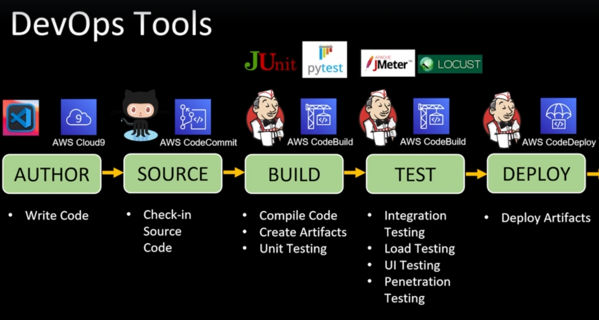
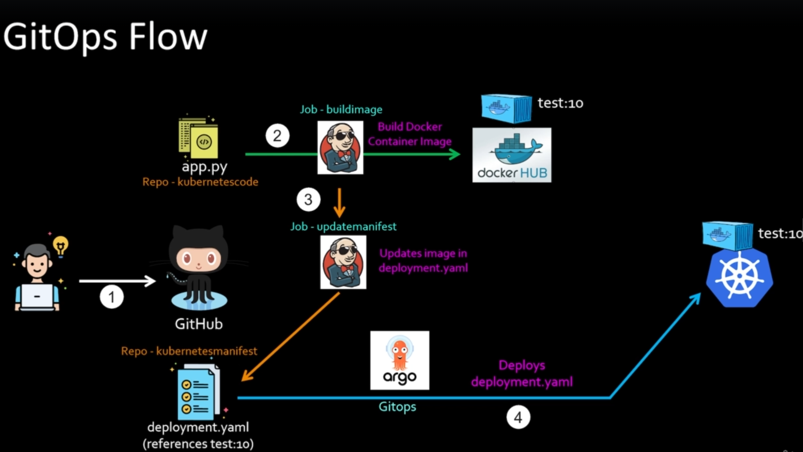
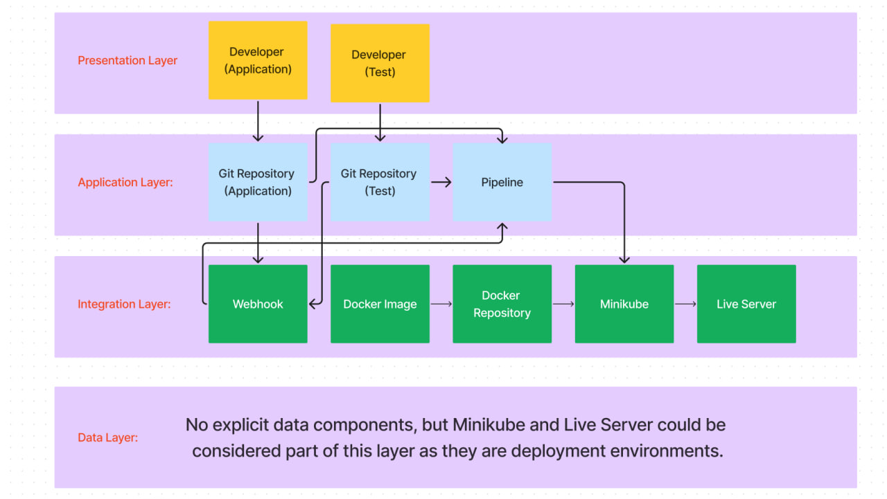
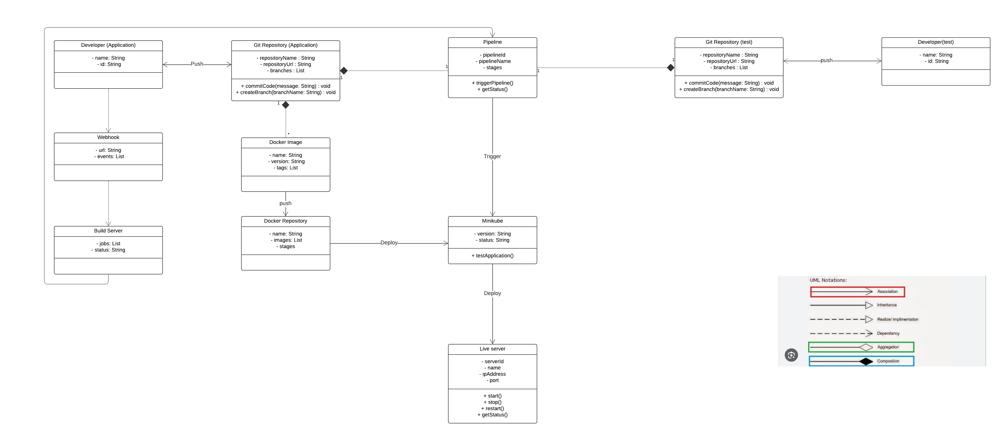
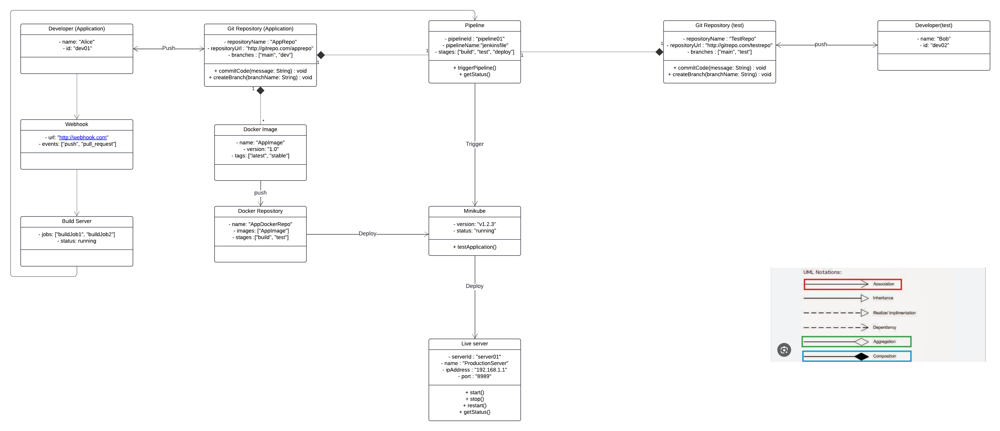
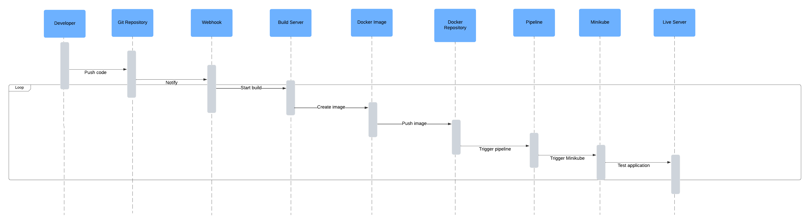

# CI/CD with GitOps

## Design Requirement Specification Document

DIBRIS – Università di Genova. Scuola Politecnica, Corso di Ingegneria del Software 80154

<!-- 
 <b> Authors </b>   AA   BB  
 -->

### REVISION HISTORY

Version | Data | Author(s)| Notes
---------|------|--------|------
1 | 31/05/2024 | Farshad Moradi Shahrbabak | First Version of the documen(Introduction, Project Description, System Overview)
1.1 | 01/06/2024 | Farshad Moradi Shahrbabak | Purpose and Scope, Bibliography, GitOps Architecture, System Data(System Inputs , system Outputs)
1.2 | 15/06/2024 | Farshad Moradi Shahrbabak | Technologies used, System Overview, System Architecture (v1), System Interfaces, System Inputs, System Ouputs
1.3 | 16/06/2024 | Farshad Moradi Shahrbabak | Class diagram(v1) , Object diagram(v1) , Dynamic Models (v1)
1.4 | 20/07/2024 | Farshad Moradi Shahrbabak | Class diagram (v2) |
1.5 | 20/07/2024 | Farshad Moradi Shahrbabak | Object diagram (v2) |
1.6 | 21/07/2024 | Farshad Moradi Shahrbabak | Dynamic Model (v2) |
1.7 | 21/07/2024 | Farshad Moradi Shahrbabak | System Architecture (v2) |

## Table of Content

- [CI/CD with GitOps](#cicd-with-gitops)
  - [Design Requirement Specification Document](#design-requirement-specification-document)
    - [REVISION HISTORY](#revision-history)
  - [Table of Content](#table-of-content)
  - [  1 Introduction](#--1-introduction)
    - [ 1.1 Purpose and Scope](#-11-purpose-and-scope)
    - [ 1.2 Definitions](#-12-definitions)
    - [ 1.3 Document Overview](#-13-document-overview)
    - [ 1.4 Bibliography](#-14-bibliography)
  - [ 2 Project Description](#-2-project-description)
    - [ 2.1 Project Introduction](#-21-project-introduction)
    - [ 2.2 Technologies used](#-22-technologies-used)
    - [ 2.3 Assumption and Constraint](#-23-assumption-and-constraint)
  - [  3 System Overview](#--3-system-overview)
    - [  3.1 System Architecture](#--31-system-architecture)
    - [  3.2 System Interfaces](#--32-system-interfaces)
    - [  3.3 System Data](#--33-system-data)
      - [  3.3.1 System Inputs](#--331-system-inputs)
      - [  3.3.2 System Ouputs](#--332-system-ouputs)
  - [  4 System Module 1](#--4-system-module-1)
    - [  4.1 Structural Diagrams](#--41-structural-diagrams)
      - [  4.1.1 Class diagram](#--411-class-diagram)
        - [  4.1.1.1 Class Description](#--4111-class-description)
      - [  4.1.2 Object diagram](#--412-object-diagram)
      - [  4.2 Dynamic Models](#--42-dynamic-models)

##   1 Introduction

    
 The aim of implementing CI/CD is to automate the process of integrating, testing, and deploying code changes, ensuring faster, more reliable, and more frequent software releases with high quality and minimal manual intervention.

   Continuous Integration (CI) and Continuous Deployment (CD) are key practices in modern software development that streamline the process of delivering code changes more frequently and reliably. Together, they form the CI/CD pipeline, which automates the steps between writing code and deploying it to production.

###  1.1 Purpose and Scope

    
 This document outlines the design specifications for implementing GitOps within our continuous integration and continuous deployment (CI/CD) pipeline 

<h3>purpose:</h3> 
The purpose of implementing GitOps is to manage infrastructure and application deployments using Git as a single source of truth, enabling automated, consistent, and auditable workflows for continuous delivery and operations.

<h3>Scope:</h3> 
The scope of implementing GitOps includes automating the deployment, management, and monitoring of infrastructure and applications using version-controlled repositories, ensuring consistent and reproducible environments across all stages of the development lifecycle.

Source Code Management:

Integrate Git repositories to serve as the single source of truth for both application and infrastructure code.
Enable version control, collaboration, and audit trails through pull requests, commits, and branches.
Automated Build and Test:

Set up CI pipelines to automatically build and test code upon commits.
Ensure that unit tests, integration tests, and other quality checks are automated and consistently applied.
Containerization:

Use Docker to containerize applications, ensuring consistent runtime environments.
Create and manage Docker images that include all necessary dependencies.
Configuration Management:

Manage infrastructure and application configurations declaratively through Git repositories.
Use tools like Kubernetes and Helm for defining and deploying configurations.
Continuous Deployment:

Implement CD pipelines to automate the deployment of applications to various environments (development, staging, production).
Ensure that deployments are triggered automatically upon successful builds and tests.
Orchestration and Infrastructure Management:

Use Kubernetes for container orchestration, ensuring applications are deployed, managed, and scaled efficiently.
Implement GitOps principles to manage Kubernetes manifests and Helm charts through Git.
Monitoring and Logging:

Set up monitoring and logging tools to track application performance, health, and logs.
Ensure that logs and metrics are accessible and actionable, enabling rapid troubleshooting and performance optimization.
Security and Compliance:

Implement security best practices within the CI/CD pipeline, such as vulnerability scanning and compliance checks.
Ensure that access controls and audit trails are in place for all GitOps processes.
Rollback and Disaster Recovery:

Define rollback procedures to quickly revert to previous versions in case of deployment failures.
Implement backup and recovery strategies for both application data and configurations.
Documentation and Training:

Provide comprehensive documentation for all CI/CD and GitOps processes.
Conduct training sessions for team members to ensure they understand and can effectively use the CI/CD pipeline and GitOps workflows.
Scalability and Performance Optimization:

Design the CI/CD pipeline and GitOps processes to handle increasing workloads and scaling requirements.
Optimize performance of the CI/CD pipeline to ensure fast and efficient builds, tests, and deployments.

###  1.2 Definitions

    
 Put a summary of the section 

    
This sub section should describe ...

| First Header  | Second Header |
| ------------- | ------------- |
| Content Cell  | Content Cell  |
| Content Cell  | Content Cell  |

###  1.3 Document Overview

    
 Explain how is organized the document
    

    
This sub section should describe ...

###  1.4 Bibliography

    
This section includes references to all sources of information that already is available for us

Book: 

Article: 

Website:
<a href="https://www.jenkins.io/doc/tutorials/">Jenkins Tutorials (Official Documentation)</a>
<a href="https://hub.docker.com/r/jenkinsci/jenkins">Jenkins Continuous Integration and Delivery server(Docker)</a>
<a href="https://minikube.sigs.k8s.io/docs/start/?arch=%2Fwindows%2Fx86-64%2Fstable%2F.exe+download">MiniKube</a>

##  2 Project Description

###  2.1 Project Introduction

    
 The primary objective of the GitOps project and propose a potential solution at a high level.
    

    
This project assumes:  
 • to use a microservice framework (SpringBoot) to implement a reference java
application. This application must be composed by a few microservices and must be
used as reference to apply the CI/CD pipeline based on GitOps paradigm. 
 • Some test cases must be implemented to validate the application. These test cases
must define the Smoke Tests executed during the CI/CD pipeline to validate the
application before installing in the production environment 
 • A production environment where release the application and make this available for the
custome

###  2.2 Technologies used

 Description of the overall architecture. 

| name          | Description |
| ------------- | ------------- |
| IDE          | An Integrated Development Environment (IDE) is a software application that provides comprehensive facilities to programmers for software development, including a code editor, debugger, and build automation tools.     |
| Github        | GitHub is a web-based platform for version control and collaborative software development, allowing users to host and review code, manage projects, and build software alongside millions of developers worldwide.  |
| Jenkins   | Jenkins is an open-source automation server used for continuous integration and continuous delivery (CI/CD) to build, test, and deploy software projects efficiently. |
| Docker  | Docker is an open-source platform that automates the deployment and management of applications within lightweight, portable containers, ensuring consistent environments across different stages of development and production.|
| Mini Kube   | Minikube is a tool that enables running a single-node Kubernetes cluster locally on your machine, making it easy to develop and test Kubernetes applications. |

# Author

Developers write and edit code using IDEs like Visual Studio Code. These tools provide a rich environment for coding, debugging, and testing at the individual level.

# Source

The code is committed to a source control system like GitHub. This step involves managing different versions of the code, collaborating with other developers, and ensuring changes are tracked and documented.

# Build

The committed code is then compiled and built into executable artifacts. This stage involves continuous integration (CI), where tools like Jenkins and AWS CodeBuild automate the process of compiling code, running unit tests, and packaging the software for deployment.

# Test

After building the software, it undergoes various testing phases to ensure it is free from bugs and performs well. Testing tools like JUnit, pytest, Apache JMeter, and Locust are used for different types of tests, including unit tests, integration tests, load tests, and penetration tests.

# Deploy 

Finally, the tested and validated software is deployed to production environments. AWS CodeDeploy automates this process, ensuring the software is deployed consistently and reliably across different environments, minimizing the risk of deployment failures.

###  2.3 Assumption and Constraint

    
 Constraints of the project implementation
 

    

    1-There isn't any cloud server (like AWS) available for running Docker and Jenkins, so they must be run on the local machine  
    

##   3 System Overview

    
 Users should be able to build, test, and deploy their code by simply pushing it to the repository as an input. Here we show the use case diagram and some of the scenarios that must be implemented. Warning this is an example and may not be complete.
    

| Use Case      | 1.0           |
| ------------- | ------------- |
| Name          | GitOps flow       |
| Actors        | Generic User  |
| Entry Point   | (1) .Java files  |
| Exit  Point   | (4) File to be deployed|
| Event Flow    | (1) User invoke the system by pushing the program.   (2) buildimage is triggered. This job is responsible for building a Docker container image from the code in the kubernetecode repository.   (3) Another CI job called updatemanifest is triggered. This job updates the deployment.yaml file in a separate GitHub repository named kubernetesmanifest.   (4) The updated deployment.yaml file is automatically picked up by Argo CD, a GitOps too |

# GitOps Flow
GitOps is a methodology that uses Git as a single source of truth for declarative infrastructure and applications. It leverages Git repositories as the source of truth for the desired state of the system, automating deployment and operations tasks. Here's a detailed breakdown of the GitOps flow illustrated in the image:

1. Code Commit
Developer writes code and commits to the repository. A developer writes or updates code in a file named app.py within a repository named kubernetescode on GitHub. The commit to GitHub triggers the CI/CD pipeline to start the build process.

2. Build Docker Image
Jenkins (or another CI tool) builds a Docker container image.

Job - buildimage: This job is responsible for building the Docker container image from the committed code.
Docker Hub: The built Docker image is then pushed to Docker Hub (a cloud-based repository service for Docker images).
The Docker image is tagged with a version, for example, test:10.

3. Update Kubernetes Manifest(Update deployment configuration)

Job - updatemanifest: This job updates the deployment configuration file, typically named deployment.yaml, in another repository called kubernetesmanifest.
The deployment.yaml file is modified to reference the new Docker image tag (test:10), ensuring that the Kubernetes deployment uses the latest version of the container image.

4. Deploy to Kubernetes Cluster(Argo CD deploys the updated configuration)

Argo CD: An open-source GitOps continuous delivery tool for Kubernetes. It monitors the Git repository for changes in the deployment configuration.
When Argo CD detects the updated deployment.yaml, it synchronizes the changes with the Kubernetes cluster.
The Kubernetes cluster then pulls the specified Docker image (test:10) from Docker Hub and deploys it, ensuring that the running application matches the desired state defined in the Git repository.

# Detailed Steps in the Flow
Step-by-Step Explanation:
Code Commit by Developer:

A developer makes changes to the application code (app.py) and commits these changes to the GitHub repository (kubernetescode).
GitHub triggers a webhook to initiate the CI/CD pipeline.
Build Docker Image:

Jenkins (or another CI/CD tool) detects the new commit and runs the buildimage job.
This job includes steps to:
Checkout the code from GitHub.
Build a Docker image using the Dockerfile included in the repository.
Tag the Docker image with a version number, such as test:10.
Push the Docker image to Docker Hub.
Update Kubernetes Manifest:

Jenkins then runs the updatemanifest job.
This job includes steps to:
Checkout the kubernetesmanifest repository.
Update the deployment.yaml file to use the new Docker image tag (test:10).
Commit the updated deployment.yaml file back to the GitHub repository (kubernetesmanifest).
Deploy to Kubernetes Cluster:

Argo CD continuously monitors the kubernetesmanifest repository for changes.
Upon detecting the updated deployment.yaml, Argo CD performs the following actions:
Synchronizes the Kubernetes cluster with the new desired state defined in deployment.yaml.
Kubernetes pulls the new Docker image (test:10) from Docker Hub.
The updated Docker image is deployed to the Kubernetes cluster, ensuring that the running application is up-to-date.

# Components and Their Roles

Developer:
Writes and commits code to the source repository.

GitHub:
Hosts the source code and the Kubernetes manifests in separate repositories.
Acts as the trigger point for CI/CD pipelines.

Jenkins:
Automates the build and update processes.
Builds Docker images and updates Kubernetes manifests.

Docker Hub:
Serves as a registry for Docker images.
Stores the built Docker images with specific tags.

Argo CD:
Automates the deployment process in Kubernetes.
Ensures the Kubernetes cluster matches the desired state defined in GitHub repositories.

Kubernetes Cluster:
Runs the deployed application.
Continuously maintains the desired state defined in the deployment configurations.

# Summary
This GitOps flow ensures that the entire process from code commit to deployment is automated and traceable via Git repositories. By using tools like Jenkins, Docker Hub, and Argo CD, the flow ensures consistent, reliable, and auditable deployments to Kubernetes clusters. This approach enhances collaboration, improves deployment speed, and maintains system stability.

###   3.1 System Architecture

    
 GitOps Architecture

| Name      | Description         |
| ------------- | ------------- |
| Git Repository (Source Control)|Centralized storage for all code and configuration files.|
| CI/CD Pipeline| Automates the process of building, testing, and deploying applications |
| Container Registry| Stores container images built by the CI/CD pipeline.  |
|Kubernetes Cluster|Orchestrates and manages containerized applications.|
|GitOps Operator|Continuously synchronizes the Kubernetes cluster with the desired state defined in the Git repository.|
|Monitoring and Logging|Tracks the health, performance, and logs of applications and infrastructure.|
|Secrets Management|Manages sensitive data securely|
|Infrastructure as Code (IaC)|Defines and manages infrastructure resources through code.|

Git Repository (Source Control):
This is the central source of truth where all the code, configuration files, and infrastructure definitions are stored. GitHub is used for source control.
Function: Stores application code, Kubernetes manifests, Helm charts, and other configuration files.

CI/CD Pipeline:
A Continuous Integration and Continuous Deployment (CI/CD) pipeline automates the process of building, testing, and deploying applications.
Function:
Build & Test: Integrates and tests changes to ensure they are production-ready.
Store Images: Builds Docker images and pushes them to a container registry.

Container Registry
A repository for storing and distributing Docker container images.
Function: Stores the container images built by the CI/CD pipeline.

GitOps Operator:
The core component of a GitOps system. It monitors the Git repository for changes and synchronizes the desired state defined in the repository with the actual state of the Kubernetes cluster.
Function: Applies the Kubernetes manifests and Helm charts from the Git repository to the Kubernetes cluster.

Kubernetes Cluster:
The runtime environment where containerized applications are deployed and managed.
Function: Runs the applications, ensuring they match the desired state defined in the manifests stored in the Git repository.

Monitoring and Logging:

Tools and systems that provide visibility into the performance and health of the applications running in the Kubernetes cluster.
Function: Collects, aggregates, and visualizes logs and metrics from the applications and the infrastructure.

Secrets Management:
A system for securely storing and managing sensitive information such as API keys, passwords, and certificates.
Function: Ensures that secrets are securely stored and accessed by applications and infrastructure components as needed. Examples include HashiCorp Vault, AWS Secrets Manager, and Kubernetes Secrets.

Infrastructure as Code (IaC)
The practice of defining and managing infrastructure using code and automation tools.
Function: Allows the definition and provisioning of infrastructure using code, making the process repeatable, scalable, and consistent.

# Detailed Workflow

Presentation Layer:
Developer (Application)
Developer (Test)
This layer represents the users (developers) who are responsible for both the application and test code.
Application Layer:
Git Repository (Application)
Git Repository (Test)
Pipeline
This layer includes the version control system (Git repositories) where both application and test code are stored.
The pipeline represents the CI/CD (Continuous Integration/Continuous Deployment) processes that automate the building, testing, and deployment of the code.

Integration Layer:
Webhook
Docker Image
Docker Repository
Minikube
Live Server
Webhook: This component is used to trigger events in the pipeline, often when changes are made in the Git repository.
Docker Image: This represents the packaged application, which includes everything needed to run the application.
Docker Repository: This is where the Docker images are stored and managed.
Minikube: This is a tool that sets up a local Kubernetes cluster for development and testing purposes.
Live Server: This is the production environment where the application is deployed and accessible to end-users.

Data Layer:
There are no explicit data components in this layer, but the Minikube and Live Server are mentioned as being part of this layer because they are deployment environments that manage the application's data.

#### Flow of Components:
Developers push code to the Git Repositories (Application/Test).
Changes in the Git repositories trigger the Pipeline.
The Pipeline builds the application and creates a Docker Image.
The Docker Image is pushed to the Docker Repository.
The Webhook can trigger additional actions in the pipeline.
The Docker Image is deployed to Minikube for testing or directly to the Live Server for production deployment.
This structure ensures that the application code is continuously integrated and deployed in an automated manner, promoting a seamless and efficient workflow from development to production.

# Benefits of GitOps Architecture

1) Single Source of Truth:
The Git repository serves as the single source of truth for both application code and infrastructure configuration, ensuring consistency and traceability.

2) Automated Deployments:
Changes committed to the Git repository automatically trigger deployment processes, reducing manual intervention and errors.

3) Version Control:
Git provides robust version control, enabling rollbacks and detailed audit trails of changes.

4) Increased Security:
Secrets management ensures sensitive information is handled securely.
GitOps promotes secure and auditable change management practices.

5) Improved Observability:
Integrated monitoring and logging provide comprehensive visibility into the system’s health and performance.

6) Scalability and Repeatability:
Infrastructure as Code (IaC) and automated pipelines ensure that infrastructure and applications can be scaled and replicated consistently across environments.

# Summary
This GitOps architecture enhances collaboration, improves deployment speed, and ensures the stability and security of applications running in a Kubernetes environment. By leveraging Git as the source of truth and automating the entire deployment pipeline, organizations can achieve a highly efficient and reliable deployment process.

###   3.2 System Interfaces

    
 Interfaces that exist in GitOps management include Git repositories for version control, CI/CD tools like Jenkins for automation, Docker for containerization, and Kubernetes for orchestration. These interfaces work together to automate and streamline the deployment and management of applications and infrastructure.
    

| Name      | Interfaces in GitOps Management |
| ------------- | ------------- |
|  Git Repositories          | Displays repositories, recent activity, and notifications ,  Lists files, directories, and their history within the repository , Allows users to review, comment, and approve changes before they are merged , hows the history of commits and the different branches within the repository.|
| Jenkins       | Provides an overview of all jobs, build statuses, and pipelines, Details for each job or pipeline, including build history, logs, and configuration options ,  Real-time and historical logs for each build, showing the steps executed and their outcomes , Interfaces for setting up and managing jobs, pipelines, credentials, and plugins , Visualization of test results, code coverage, and build metrics.|
| Docker   | Summary of container status, images, and repositories , Lists available images, tags, and details about each image , Shows running containers, their statuses, logs, and resource usage , Allows users to search and pull images from Docker Hub or other registries.|
|Kubernetes    | Overview of cluster status, nodes, namespaces, and workloads,  Lists deployments, pods, replica sets, and services, showing their status and resource usage ,Displays information about cluster nodes, including health, capacity, and performance metrics.|

1. Git Repository Interface
Purpose: Acts as the source of truth for both application code and infrastructure configurations.
Components:
GitHub: Popular platform for hosting Git repositories.
Files and Directories: Contain application code, Kubernetes manifests, Helm charts, and Infrastructure as Code (IaC) files.
Functions:
Version Control: Tracks changes to files, enabling rollbacks and maintaining a history of changes.
Collaboration: Facilitates collaboration through pull requests, code reviews, and comments.
Triggering CI/CD Pipelines: Commits and merges to specific branches can trigger CI/CD pipelines.

2. CI/CD Pipeline Interface
Purpose: Automates the build, test, and deployment processes.
Components:
Jenkins: CI/CD tools that orchestrate automated workflows.
Build Scripts: Define the steps for building and testing the application.
Configuration Files: Such as .travis.yml, Jenkinsfile, etc., which define the CI/CD pipeline stages.
Functions:
Building: Compiles the application code and builds Docker images.
Testing: Runs automated tests to ensure code quality.
Deploying: Pushes Docker images to container registries and updates manifests in the Git repository.

3. Container Registry Interface
Purpose: Stores and distributes Docker images.
Components:
Docker Hub/Amazon ECR/Google Container Registry: Services for storing Docker images.
Image Tags: Identify specific versions of Docker images.
Functions:
Storing Images: Keeps built Docker images ready for deployment.
Versioning: Uses tags to manage different versions of images.
Pulling Images: Kubernetes clusters pull images from the registry based on the tags specified in deployment manifests.

4. GitOps Operator Interface
Purpose: Monitors the Git repository for changes and synchronizes the desired state with the Kubernetes cluster.
Components:
Argo CD: Popular GitOps operator that manage deployments.
Synchronization Mechanism: Watches the Git repository and applies changes to the cluster.
Functions:
Syncing: Detects changes in the Git repository and updates the Kubernetes cluster to match the desired state.
Reconciliation: Continuously ensures that the actual state of the cluster matches the desired state defined in the Git repository.
Rollback: Provides mechanisms to revert to previous states if issues are detected.

5. Kubernetes Cluster Interface
Purpose: Executes and manages containerized applications.
Components:
API Server: The core interface to interact with the Kubernetes cluster.
Kubelet: Runs on each node and manages containers.
Kubectl: Command-line tool to interact with the Kubernetes cluster.
Functions:
Deploying Applications: Runs containers based on the manifests defined in the Git repository.
Scaling: Automatically adjusts the number of running instances based on demand.
Self-healing: Automatically restarts failed containers and reschedules them on healthy nodes.

6. Monitoring and Logging Interface
Purpose: Provides visibility into the health and performance of applications and infrastructure.
Components:
minikube: For metrics collection and visualization.
Functions:
Collecting Metrics: Gathers performance and usage metrics from the cluster and applications.
Aggregating Logs: Collects and stores logs for analysis and troubleshooting.
Visualizing Data: Provides dashboards and visual representations of metrics and logs.
Alerting: Sends alerts based on predefined conditions or thresholds.

7. Infrastructure as Code (IaC) Interface
Purpose: Defines and manages infrastructure using code.
Components:
Terraform: Tools for IaC.
Configuration Files: Define infrastructure resources and their dependencies.
Functions:
Provisioning: Automatically sets up and configures infrastructure.
Versioning: Tracks changes to infrastructure configurations, enabling rollbacks.
Automation: Reduces manual intervention by automating infrastructure setup and management.
Interaction and Workflow

1. Development and Commit
Developers make changes to application code and infrastructure configurations, committing these changes to the Git repository.
2. Triggering CI/CD Pipeline
The commit triggers the CI/CD pipeline, which builds the application, runs tests, and stores the Docker images in the container registry.
3. Updating Manifests
The pipeline updates Kubernetes manifests in the Git repository to reference the new Docker image versions.
4. GitOps Operator Sync
The GitOps operator detects changes in the Git repository and synchronizes the Kubernetes cluster with the updated manifests.
5. Deployment and Monitoring
The Kubernetes cluster deploys the updated applications. Monitoring and logging systems collect metrics and logs, providing visibility and alerting on the system's health and performance.
6. Secret Management and IaC
Secrets management ensures sensitive data is securely handled. IaC tools provision and manage infrastructure resources as defined in the code.

# Benefits of GitOps Interfaces
Consistency and Traceability: All changes are version-controlled in Git, providing a clear history and audit trail.
Automation and Efficiency: Automates the build, test, and deployment processes, reducing manual errors and speeding up delivery.
Scalability: Easily scales infrastructure and applications by defining configurations in code.
Security: Manages secrets securely and ensures access control policies are enforced.
Observability: Provides comprehensive monitoring and logging, ensuring issues are detected and resolved quickly.
Collaboration: Facilitates collaboration among teams through Git workflows, pull requests, and code reviews.
This comprehensive explanation outlines the critical interfaces in GitOps management, detailing their roles, components, and interactions within the GitOps workflow, ensuring a robust, secure, and efficient deployment process.

###   3.3 System Data

    
 In this section we describe the inputs and outputs as well as their format.
    

    
By clearly defining the inputs and outputs at each stage of the GitOps CI/CD process, the workflow ensures a streamlined and automated approach to building, testing, and deploying applications. This results in consistent, reliable, and efficient software delivery.

####   3.3.1 System Inputs

    
 System Inputs

| Name|Description|
| ------------- | ------------- |
|Source Code|The primary input is the application code that developers write and maintain.(Developers commit their code to a version-controlled repository (e.g., GitHub, GitLab)) |
|Configuration Files|These include YAML or JSON files that define the desired state of the infrastructure and applications(Jenkinsfile)|
|Dockerfiles| These include YAML or JSON files that define the desired state of the infrastructure and applications.|
|Test Scripts|Scripts and configurations for automated testing, including unit tests, integration tests, and end-to-end tests.|
|Secrets and Environment Variables|Sensitive information and configuration settings required by the application.|

# Detailed Workflow of CI/CD Inputs

### Code Check-in and Version Control
Input: Source Code
Process: Developers write code and commit changes to a version control system (VCS) like Git. Each commit or pull request triggers the CI/CD pipeline.
Tools: GitHub

### Build Configuration
Input: Configuration Files, Dependency Files
Process: The pipeline uses build configuration files (e.g., Jenkinsfile) to define the build steps. Dependency files ensure all required libraries and tools are installed.
Tools: Jenkins

### Automated Testing
Input: Test Data and Test Cases
Process: The pipeline runs automated tests using the provided test data and test cases. This step verifies that the application functions correctly and meets quality standards.
Tools: JUnit, pytest, Selenium.

### Containerization
Input: Docker Images and Containers
Process: The pipeline builds Docker images using a Dockerfile and pushes these images to a container registry. These images are then used to deploy the application.
Tools: Docker, Docker Hub

### Deployment
Input: Configuration Files, Docker Images
Process: The deployment stage reads the deployment configuration files (e.g., k8s-deployment.yaml) and uses them to deploy the application containers to the target environment.
Tools: Kubernetes, Argo CD

### Monitoring and Logging
Input: Metrics and Logging Configurations
Process: Monitoring and logging tools collect and process logs and metrics during and after the deployment. This helps in tracking the application's performance and diagnosing issues.
Tools:minikube

####   3.3.2 System Ouputs

    
 System Ouputs

| Name|Description|
| ------------- | ------------- |
|Built Artifacts|Compiled and packaged versions of the application, in the form of Docker images.|
|Deployment Manifests|Updated configuration files that specify the desired state of the application in the Kubernetes cluster.|
|Deployed Applications|Running instances of the application within the Kubernetes cluster.|
|Logs and Metrics|Output from application and infrastructure monitoring tools, including performance metrics, logs, and alerts.|
|Test Reports| Results from automated tests, providing feedback on the code quality and functionality.|

# Key System Outputs in CI/CD

### Build Artifacts
Description: These are the compiled, packaged, and ready-to-deploy versions of the application.
Components: Executable binaries, JAR files, WAR files, Docker images.
Purpose: Serve as the deployable version of the application, created from the source code and ready to be tested and deployed.

### Docker Images
Description: Containerized versions of the application, encapsulated with all dependencies and configurations.
Components: Docker image files stored in a container registry.
Purpose: Ensure consistency across different environments by running the same containerized application in development, testing, and production environments.

### Test Reports and Results
Description: Detailed results of automated tests run during the pipeline execution.
Components: Unit test results, integration test results, end-to-end test results, coverage reports.
Purpose: Provide insights into the quality of the code, highlighting any issues or failures that need to be addressed before deployment.

### Deployment Manifests
Description: Configuration files that define how the application should be deployed in different environments.
Components: Kubernetes manifests (deployment.yaml), Helm charts, Terraform files.
Purpose: Automate and standardize the deployment process, ensuring that the application is deployed consistently across environments.

### Logs and Audit Trails
Description: Detailed logs of the CI/CD pipeline execution, including steps performed, success and failure messages, and timestamps.
Components: Build logs, deployment logs, audit logs.
Purpose: Provide traceability and accountability, allowing developers and operators to troubleshoot issues and understand the history of changes.

### Monitoring Data and Metrics
Description: Metrics and data collected from the application and infrastructure during and after deployment.
Components: Performance metrics, resource usage, health checks.
Purpose: Monitor the health and performance of the application, ensuring that it meets the required standards and operates reliably.

### Notifications and Alerts
Description: Automated alerts and notifications sent to stakeholders about the status of the pipeline and deployed application.
Components: Email notifications.
Purpose: Keep stakeholders informed about the build, test, and deployment status, as well as any issues that require immediate attention.

##   4 CI/CD with GitOps

    
Here we describe the structure of the system.

    
First we describe the Static structure of the system, such as the Class/Object Diagram, and then we describe the dynamic behavior of the system.

###   4.1 Structural Diagrams

    
 Here we describe two different types of view of the system, class, and Object Diagram
    

    

####   4.1.1 Class diagram

    
 class diagram with the types of attributes and methods included for a CI/CD system integrated with GitOps
    

#####   4.1.1.1 Class Description

    
Class Description

1. Developer (Application)
Attributes:
name: String: Represents the name of the developer.
id: String: Unique identifier for the developer.
Relationships:
Pushes code: The developer interacts with the Git Repository (Application) by pushing code to it. This is indicated by a solid line with a filled arrowhead pointing from the Developer to the Git Repository.
2. Git Repository (Application)
Attributes:
repositoryName: String: The name of the repository.
repositoryUrl: String: The URL where the repository is hosted.
branches: List: A list of branches in the repository.
Methods:
commitCode(message: String): void: Allows the developer to commit code with a specific message.
createBranch(branchName: String): void: Allows the creation of a new branch in the repository.
Relationships:
Pushes to Webhook: When code is committed, a webhook is triggered, initiating further actions in the pipeline. This is represented by an association line with a filled arrowhead.
3. Webhook
Attributes:
url: String: The URL endpoint for the webhook.
events: List: A list of events that the webhook is configured to listen for.
Relationships:
Triggers Build Server: When the webhook is activated, it triggers the build server to start its processes. This is depicted by an association line with a filled arrowhead.
4. Build Server
Attributes:
jobs: List: A list of jobs or tasks that the build server is responsible for executing.
status: String: The current status of the build server.
Relationships:
Pushes Docker Image: The build server creates and pushes Docker images to the Docker repository. This is represented by an association line with a filled arrowhead pointing to the Docker Image class.
5. Docker Image
Attributes:
name: String: The name of the Docker image.
version: String: The version of the Docker image.
tags: List: A list of tags associated with the Docker image.
Relationships:
Pushed to Docker Repository: Once created, Docker images are pushed to the Docker Repository. This is indicated by an association line with a filled arrowhead.
6. Docker Repository
Attributes:
name: String: The name of the Docker repository.
images: List: A list of Docker images stored in the repository.
stages: List: Various stages involved in handling Docker images.
Relationships:
Deploys to Minikube: Docker images are deployed from the Docker repository to Minikube for further testing and deployment. This is depicted by an association line with a filled arrowhead pointing to Minikube.
7. Pipeline
Attributes:
pipelineId: String: The unique identifier for the pipeline.
pipelineName: String: The name of the pipeline.
stages: Different stages in the pipeline.
Methods:
triggerPipeline(): void: Method to trigger the pipeline.
getStatus(): void: Method to get the current status of the pipeline.
Relationships:
Triggers Minikube: The pipeline triggers Minikube to test and deploy applications. This is shown by an association line with a filled arrowhead.
8. Minikube
Attributes:
version: String: The version of Minikube being used.
status: String: The current status of Minikube.
Methods:
testApplication(): void: Method to test applications within Minikube.
Relationships:
Deploys to Live Server: Minikube, after testing, deploys the application to the live server for production use. This is represented by an association line with a filled arrowhead.
9. Live Server
Attributes:
serverId: String: Unique identifier for the live server.
name: The name of the live server.
ipAddress: The IP address of the live server.
port: The port number on which the live server is running.
Methods:
start(): void: Starts the live server.
stop(): void: Stops the live server.
restart(): void: Restarts the live server.
getStatus(): void: Gets the current status of the live server.
10. Developer (Test)
Attributes:
name: String: Represents the name of the test developer.
id: String: Unique identifier for the test developer.
Relationships:
Pushes code: Similar to the application developer, the test developer pushes code to the Git Repository (Test). This is indicated by a solid line with a filled arrowhead.
11. Git Repository (Test)
Attributes:
repositoryName: String: The name of the repository.
repositoryUrl: String: The URL where the repository is hosted.
branches: List: A list of branches in the repository.
Methods:
commitCode(message: String): void: Allows the test developer to commit code with a specific message.
createBranch(branchName: String): void: Allows the creation of a new branch in the repository.

### Notations 
Association: Regular connection (red arrow) showing a general relationship between classes.
Inheritance: Represents inheritance (black arrow) indicating a class is derived from another class.
Realize/Implementation: Dashed line with an open arrowhead, showing an interface implementation.
Dependency: Dashed line with an open arrowhead, showing that a class depends on another class.
Aggregation: Represents a whole-part relationship (green diamond) where the part can exist independently of the whole.
Composition: Strong ownership (blue diamond) where the part cannot exist independently of the whole.

### Summary
The diagram represents the flow of code from developers through a CI/CD pipeline, involving steps like code commits, triggering webhooks, building on a build server, creating and pushing Docker images, deploying to a test environment (Minikube), and finally to a live production server. The relationships and methods indicate how each component interacts with the others to automate and streamline the development and deployment process.

####   4.1.2 Object diagram

    
 snapshot of the system at a particular point in time, showing the instances of classes (objects) and their relationships. While class diagrams show the static structure of the system, object diagrams illustrate the actual data and its interactions during runtime.
    

1. Developer (Application)
Instance:
name: "Alice"
id: "dev01"
This instance represents a developer named Alice with an ID of "dev01".

2. Git Repository (Application)
Instance:
repositoryName: "AppRepo"
repositoryUrl: "http://gitrepo.com/apprepo"
branches: ["main", "dev"]
This instance represents a Git repository for the application with the name "AppRepo", located at the specified URL, and containing branches "main" and "dev".

3. Webhook
Instance:
url: "http://webhook.com"
events: ["push", "pull_request"]
This represents a webhook configured to listen to "push" and "pull_request" events at the specified URL.

4. Build Server
Instance:
jobs: ["buildJob1", "buildJob2"]
status: "running"
This represents a build server running two jobs, "buildJob1" and "buildJob2", with its status being "running".

5. Docker Image
Instance:
name: "AppImage"
version: "1.0"
tags: ["latest", "stable"]
This represents a Docker image named "AppImage" with version "1.0" and tagged as "latest" and "stable".

6. Docker Repository
Instance:
name: "AppDockerRepo"
images: ["AppImage"]
stages: ["build", "test"]
This instance represents a Docker repository named "AppDockerRepo" containing the "AppImage" and having stages "build" and "test".

7. Pipeline
Instance:
pipelineId: "pipeline01"
pipelineName: "CI/CD Pipeline"
stages: ["build", "test", "deploy"]
This represents a pipeline with the ID "pipeline01", named "CI/CD Pipeline", and having stages "build", "test", and "deploy".

8. Minikube
Instance:
version: "v1.2.3"
status: "running"
This represents a Minikube instance running version "v1.2.3" with a status of "running".

9. Live Server
Instance:
serverId: "server01"
name: "ProductionServer"
ipAddress: "192.168.1.1"
port: "80"
This represents a live server with ID "server01", named "ProductionServer", located at IP address "192.168.1.1", and listening on port "80".

10. Git Repository (test)
Instance:
repositoryName: "TestRepo"
repositoryUrl: "http://gitrepo.com/testrepo"
branches: ["main", "test"]
This represents a Git repository for testing purposes named "TestRepo", located at the specified URL, and containing branches "main" and "test".

11. Developer (test)
Instance:
name: "Bob"
id: "dev02"
This represents a developer named Bob with an ID of "dev02".

### Relationships and Interactions
Push: Developers (Alice and Bob) push code to their respective Git repositories.
Commit Code and Create Branch: These methods are part of the Git Repository class to manage code and branches.
Webhook: Triggered by events in the Git repository, it notifies the Build Server.
Build Server: Executes jobs based on webhook triggers.
Docker Image and Repository: The build server pushes Docker images to the Docker repository.
Pipeline: The pipeline is triggered, which then deploys the Docker image to Minikube for testing.
Minikube and Live Server: After testing, the application is deployed from Minikube to the live server.

####   4.2 Dynamic Models

    
 The dynamic model of a CI/CD system provides a comprehensive view of the interactions and behaviors within the system over time 

    

This sequence diagram illustrates a typical CI/CD (Continuous Integration/Continuous Deployment) pipeline. Here’s an explanation of each component and step involved in the process:

Developer: The process begins with the developer writing code and pushing it to the Git repository.

Git Repository: Once the code is pushed to the repository, a webhook is triggered. This webhook is set up to notify the build server about the new changes.

Webhook: The webhook detects the new code push and notifies the build server to start the build process.

Build Server: Upon receiving the notification, the build server starts the build process. This typically includes tasks like compiling the code, running unit tests, and packaging the application.

Docker Image: After the build process is successful, a Docker image of the application is created. This image includes everything needed to run the application, such as code, runtime, libraries, and environment variables.

Docker Repository: The created Docker image is then pushed to a Docker repository, a centralized place to store and manage Docker images.

Pipeline: After the Docker image is pushed, it triggers the CI/CD pipeline. The pipeline automates the process of deploying the application to different environments, such as development, staging, and production.

Minikube: The pipeline triggers Minikube, which is a local Kubernetes cluster. Minikube is used for testing the application in a Kubernetes environment before deploying it to a live server.

Live Server: Finally, once the application passes all tests in Minikube, it is deployed to the live server where it can be accessed by end-users.

Loop: This process is typically looped, meaning it continuously runs whenever new code is pushed to the repository. This ensures that the latest changes are always tested and deployed automatically.

### Detailed Steps:
Push code: The developer pushes new code changes to the Git repository.
Notify: The webhook is triggered, notifying the build server of the new code.
Start build: The build server starts the build process.
Create image: The build server creates a Docker image of the application.
Push image: The Docker image is pushed to the Docker repository.
Trigger pipeline: The CI/CD pipeline is triggered to start the deployment process.
Trigger Minikube: The pipeline triggers a test deployment in Minikube.
Test application: The application is tested in the Minikube environment to ensure it works correctly.
Deploy to Live Server: After successful testing, the application is deployed to the live server.
This CI/CD pipeline ensures that the software is always in a deployable state, allowing for frequent and reliable deployments.

