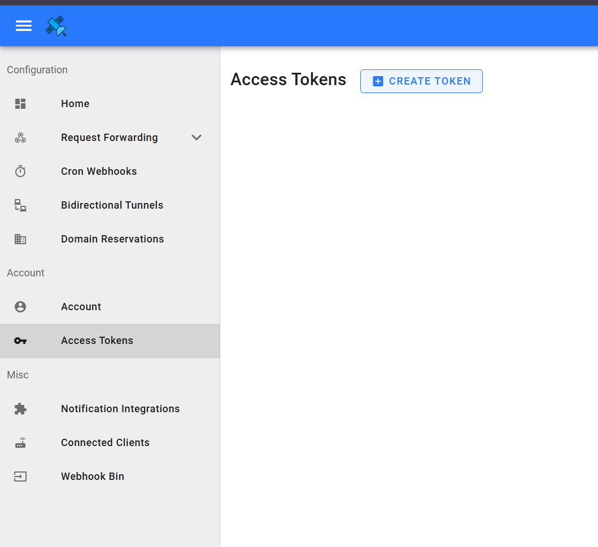
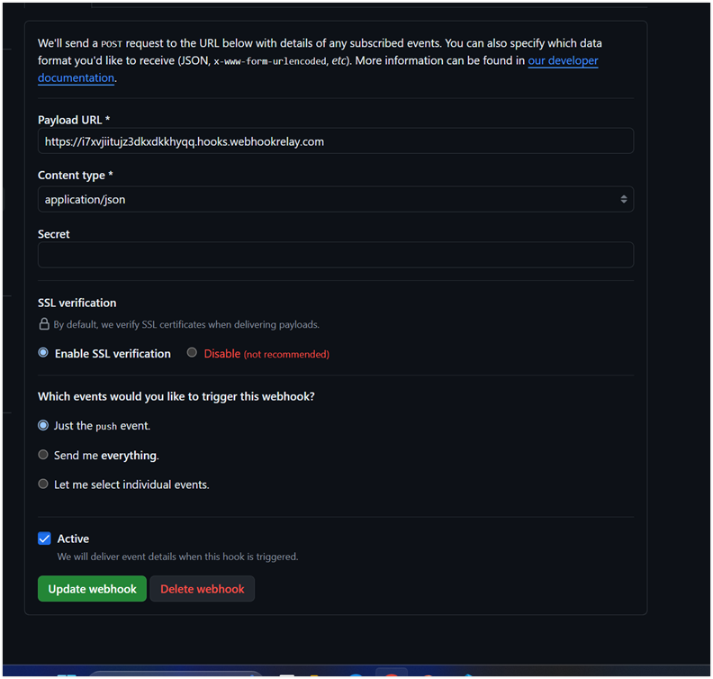

# Installation & Setup Guide

This guide provides instructions for setting up and configuring the tools required for the project: **Docker, Jenkins, Minikube and Webhook**.

Follow the steps for your operating system.

## Table of Contents

1. [Installing Docker Desktop](#1-installing-docker-desktop)
2. [Installing Docker-Compose](#2-installing-docker-compose)
3. [Installing Minikube](#3-installing-minikube)
4. [Installing kubectl](#4-installing-kubectl)
5. [Installing Jenkins](#5-installing-jenkins)
6. [Configuring Jenkins](#6-configuring-jenkins)
7. [Setup webhook](#7-setup-webhook)

## 1. Installing Docker Desktop

### macOS

1. Download Docker Desktop from [Docker's official website](https://www.docker.com/products/docker-desktop/).
2. Install and verify using:

   ```bash
   docker --version
   ```

### Ubuntu

#### 1. Update System Packages

Open a terminal and update the system package index:

   ```bash
   sudo apt update
   sudo apt upgrade -y
   ```

#### 2. Install Required Dependencies

Install necessary packages to allow apt to use a repository over HTTPS:

   ```bash
   sudo apt install apt-transport-https ca-certificates curl software-properties-common -y
   ```

#### 3. Add Docker’s GPG Key

Check the version to confirm it is installed successfully:

   ```bash
   curl -fsSL https://download.docker.com/linux/ubuntu/gpg | sudo gpg --dearmor -o /usr/share/keyrings/docker-archive-keyring.gpg
   ```

#### 4. Add Docker Repository

Add the Docker repository to apt sources:

   ```bash
   echo \
  "deb [arch=amd64 signed-by=/usr/share/keyrings/docker-archive-keyring.gpg] https://download.docker.com/linux/ubuntu \
  $(lsb_release -cs) stable" | sudo tee /etc/apt/sources.list.d/docker.list > /dev/null
   ```

#### 5. Install Docker Engine

Update your package index again and install Docker:

   ```bash
   sudo apt update
   sudo apt install docker-ce docker-ce-cli containerd.io -y
   ```

#### 6. Start and Enable Docker

Enable Docker to start on boot and verify that it is running:

   ```bash
   sudo systemctl start docker
   sudo systemctl enable docker
   ```

#### 7. Verify Docker Installation

Check Docker version to ensure it is installed successfully:

   ```bash
   docker --version
   ```

## 2. Installing Docker-Compose

### Ubuntu

#### 1. Install the Latest Version of Docker Compose

Install the Latest Version of Docker Compose:

   ```bash
   sudo curl -L "https://github.com/docker/compose/releases/latest/download/docker-compose-$(uname -s)-$(uname -m)" -o /usr/local/bin/docker-compose
   ```

## 3. Installing Minikube

### macOS

1. Install Minikube:

   ```bash
   brew install minikube
   minikube start
   ```

2. Verify:

   ```bash
   minikube status
   ```

### Ubuntu

1. Install Minikube:

   ```bash
   sudo curl -LO https://storage.googleapis.com/minikube/releases/latest/minikube-linux-amd64
   sudo install minikube-linux-amd64 /usr/local/bin/minikube
   ```

2. Verify:

   ```bash
   minikube version
   ```


## 4. Installing kubectl

### macOS

Install using Homebrew:

```bash
brew install kubectl
```

### Ubuntu

Here’s how you can install kubectl, the Kubernetes command-line tool:

```bash
sudo apt-get update
sudo apt-get install -y apt-transport-https ca-certificates curl
sudo curl -fsSLo /usr/share/keyrings/kubernetes-archive-keyring.gpg https://packages.cloud.google.com/apt/doc/apt-key.gpg
echo "deb [signed-by=/usr/share/keyrings/kubernetes-archive-keyring.gpg] https://apt.kubernetes.io/ kubernetes-xenial main" | sudo tee /etc/apt/sources.list.d/kubernetes.list
sudo apt-get update
sudo apt-get install -y kubectl
```

#### Option B: Install kubectl binary with curl on Linux

x86-64:

```bash
curl -LO "https://dl.k8s.io/release/$(curl -L -s https://dl.k8s.io/release/stable.txt)/bin/linux/amd64/kubectl"
```

ARM64:

```bash
curl -LO "https://dl.k8s.io/release/$(curl -L -s https://dl.k8s.io/release/stable.txt)/bin/linux/arm64/kubectl"
```

#### Option c: Install kubectl binary with curl on Linux
```bash
sudo snap install kubectl --classic
```

## 5. Installing Jenkins

### macOS

1. Install using Homebrew:

   ```bash
   brew install jenkins-lts
   brew services start jenkins-lts
   ```

2. Access Jenkins at: [http://localhost:8080](http://localhost:8080)

### Ubuntu

#### 1. Installation of Java

Jenkins requires Java to run, yet not all Linux distributions include Java by default. Additionally, not all Java versions are compatible with Jenkins.

There are multiple Java implementations which you can use. OpenJDK is the most popular one at the moment, we will use it in this guide.

Update the Debian apt repositories, install OpenJDK 17, and check the installation with the commands:

```bash
sudo apt update
sudo apt install fontconfig openjdk-17-jre
java -version
openjdk version "17.0.8" 2023-07-18
OpenJDK Runtime Environment (build 17.0.8+7-Debian-1deb12u1)
OpenJDK 64-Bit Server VM (build 17.0.8+7-Debian-1deb12u1, mixed mode, sharing)
```

#### 2. Installation of Jenkins

Long Term Support release
A LTS (Long-Term Support) release is chosen every 12 weeks from the stream of regular releases as the stable release for that time period. It can be installed from the debian-stable apt repository.

   ```bash
sudo wget -O /usr/share/keyrings/jenkins-keyring.asc \
  https://pkg.jenkins.io/debian-stable/jenkins.io-2023.key
echo "deb [signed-by=/usr/share/keyrings/jenkins-keyring.asc]" \
  https://pkg.jenkins.io/debian-stable binary/ | sudo tee \
  /etc/apt/sources.list.d/jenkins.list > /dev/null
sudo apt-get update
sudo apt-get install jenkins
   ```

#### 3. Start Jenkins

You can enable the Jenkins service to start at boot with the command:

 ```bash
sudo systemctl enable jenkins
   ```

You can start the Jenkins service with the command:

```bash
sudo systemctl start jenkins
   ```

You can check the status of the Jenkins service using the command:

```bash
sudo systemctl status jenkins
   ```

If everything has been set up correctly, you should see an output like this:

```bash
Loaded: loaded (/lib/systemd/system/jenkins.service; enabled; vendor preset: enabled)
Active: active (running) since Tue 2018-11-13 16:19:01 +03; 4min 57s ago
   ```
#### 4. Access Jenkins

Access Jenkins at: [http://localhost:8080](http://localhost:8080)

#### 5. Run Jenkins

To ensure Jenkins is securely set up by the administrator, a password has been written to the log and this file on the server:

```bash
/var/lib/jenkins/secrets/initialAdminPassword
```


```bash
sudo cat /var/lib/jenkins/secrets/initialAdminPassword
```
#### 6. Install Jenkins Plugins:

Plugins extend Jenkins with additional features to support many different needs. Click on the "Install suggested plugins".


## 6. Configuring Jenkins

### Changing the Default Port in Jenkins

When we deploy the project on `Minikube` locally, it forwards the `API-GATEWAY` microservice on port `8080`. Therefore, we need to change the default port of Jenkins from 8080 to something else (`9090`) to avoid services overlapping each other.

### macOS

1. **Locate the Configuration File**:
   - macOS: `/opt/homebrew/opt/jenkins-lts/homebrew.mxcl.jenkins-lts.plist`

2. **Modify the Port**:
   - Open the file with a text editor:

     ```bash
     sudo nano /path/to/configuration/file
     ```

   - Find and update the port:
     - macOS: Look for `--httpPort=8080` and change `8080` to your desired port.
     - Ubuntu/Linux: Update `HTTP_PORT=8080` to your desired port.

3. **Restart Jenkins**:

     ```bash
     brew services restart jenkins-lts
     ```

4. **Verify**:
   Open your browser and go to:

   ```shell
   http://localhost:<your-port>
   ```

### Ubuntu

```bash
systemctl edit jenkins
```

change the port:

```bash
[Service]
Environment="JENKINS_PORT=9090"
```

#### Option B: Directly Edit the File

If you prefer to directly modify the original file:

```bash
sudo nano /lib/systemd/system/jenkins.service
```

Find the line:

```bash
Environment="JENKINS_PORT=8080"
```

Change the port to your desired value, e.g.:

```bash
Environment="JENKINS_PORT=9090"
```

### Adding Minikube and Docker Paths to Jenkins

#### Step 1: Locate Minikube and Docker Paths

On macOS/Linux, you can locate the paths for Minikube and Docker by running the following commands in the terminal:

```shell
which minikube

which docker
```

#### Step 2: Access Jenkins Global Configuration

1. Open your Jenkins instance in a web browser.
2. Navigate to:  
   `Dashboard > Manage Jenkins > System > Global Properties`.
3. Enable the **Environment variables** option.

#### Step 3: Add Paths to Jenkins

1. In the **Environment variables** section, click **Add** to create a new variable.
2. Fill in the details as follows:
   - **Name**: `PATH+EXTRA`
   - **Value**: Add the paths to Minikube and Docker, separated by a colon (`:`). For example on macOS:

     ```shell
     /opt/homebrew/bin:/usr/local/bin
     ```

#### Step 4: Save and Apply Changes

1. After entering the paths, click **Save** to apply the changes.
2. Restart Jenkins if necessary to ensure the new environment variables are loaded.


## 7. Setup webhook

Follow these steps to set up a webhook and install Webhook Relay for forwarding webhooks to your local application securely.

### Step 1: Create an Account on Webhook Relay

1. Visit [Webhook Relay](https://my.webhookrelay.com/login).
2. Click **Sign Up** or **Log In** if you already have an account.
3. Complete the registration process and keep your credentials ready.

### Step 2: Install Webhook Relay Agent

#### For Linux/macOS

1. Open a terminal.
2. Download and install the Webhook Relay agent:

   ```bash
   curl -s https://my.webhookrelay.com/downloads/install.sh | bash
   ```

### Verify Installation

1. Open Command Prompt or PowerShell.
2. Type the following command to check if the installation was successful:

   ```powershell
   relay --version
   ```

### Step 3: Creating an Access Token



Follow these steps to create an access token in Webhook Relay:

1. **Navigate to the Access Tokens Page**:
   - In the Webhook Relay dashboard, click on **Access Tokens** in the left-hand menu under the **Account** section.

2. **Create a New Token**:
   - On the **Access Tokens** page, click the **CREATE TOKEN** button located at the top-right corner.

3. **Configure and Save**:
   - Follow the prompts to configure the token.
   - Save the token details securely as you will need them to authenticate your relay agent.

### Notes

- Access tokens are used to secure your Webhook Relay buckets and agent connections.
- If you lose the token, you will need to regenerate it as it cannot be retrieved again.

### Step 4: Log In to Webhook Relay with Access Tokens

To authenticate the Webhook Relay agent using your token, run the following command:

```bash
relay login -k your-token-key -s your-token-secret
```

Example:
Replace your-token-key and your-token-secret with the actual key and secret from your access token. For example:

```bash
relay login -k 7bbe856d-af75-416f-b7be-1782b6bbe37a -s IQffIkWM4F0w
```

### Step 5: relay forward

The `relay forward` command is used to map a Webhook Relay bucket to a local application endpoint. This allows webhooks sent to the public URL of the bucket to be forwarded to your local server.

### Command Syntax

```bash
relay forward --bucket <bucket-name> <local-endpoint>
```

Example:
To forward webhooks from the bucket github-jenkins to the local endpoint <http://localhost:7777/github-webhook/>, run:

```bash
relay forward --bucket github-jenkins http://localhost:7777/github-webhook/
```

### Step 6: Configuring Webhook Settings in GitHub



1. **Payload URL**:
   - Enter the URL where you want to send the webhook's payload.
   - Example: `https://<your-unique-url>.hooks.webhookrelay.com`
   - This is the endpoint that will receive webhook events.

2. **Content Type**:
   - Specify the format for the webhook payload.
   - Options:
     - `application/json` (recommended): Sends the payload as a JSON object.
     - `application/x-www-form-urlencoded`: Sends the payload as a URL-encoded string.

3. **Secret** (Optional):
   - Set a secret token to secure the webhook.
   - The secret ensures that only payloads from GitHub are accepted by your server.
   - Your application should validate the `X-Hub-Signature` header using this secret.

4. **SSL Verification**:
   - Ensure that GitHub verifies SSL certificates for secure webhook delivery.
   - Options:
     - **Enable SSL verification** (recommended): Ensures secure communication.
     - **Disable SSL verification** (not recommended): Used for testing purposes with self-signed certificates.

5. **Event Triggers**:
   - Choose which events will trigger the webhook.
   - Options:
     - **Just the push event**: Triggered on every push to the repository.
     - **Send me everything**: Triggered for all available events.
     - **Let me select individual events**: Allows you to pick specific events like issues, pull requests, etc.

6. **Active**:
   - Ensure this checkbox is selected to activate the webhook.

## Steps to Configure

1. Go to your GitHub repository.
2. Navigate to **Settings > Webhooks**.
3. Click **Add webhook** or edit an existing webhook.
4. Fill in the required fields:
   - **Payload URL**: Enter your endpoint URL.
   - **Content Type**: Choose the desired format (`application/json` recommended).
   - **Secret**: Optionally, add a secret token.
   - **SSL Verification**: Ensure SSL verification is enabled.
   - **Event Triggers**: Select the events you want to monitor.
5. Check the **Active** box.
6. Click **Update Webhook** to save your settings.
