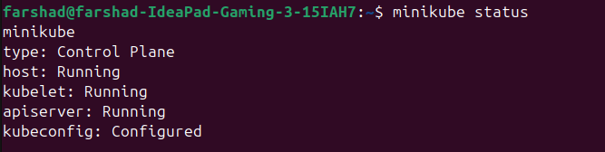
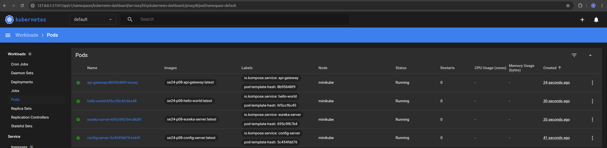

# Run Guide

This guide outlines 3 methods for running microservices, performing smoke tests, and deploying them in a Minikube environment.

## Table of Contents

- [Method 1: Running Microservices Locally with Docker-Compose](#method-1-running-microservices-locally-with-docker-compose)
- [Method 2: Running Microservices in Minikube Environment](#method-2-running-microservices-in-minikube-environment)
- [Method 3: Automated CI/CD Pipeline in Jenkins: Build, Smoke Test, and Deploy](#method-3-automated-cicd-pipeline-in-jenkins-build-smoke-test-and-deploy)
  - [**Pipeline 1: Test Environment Deployment (`se24-p08`)**](#pipeline-1-test-environment-deployment-se24-p08)
  - [**Pipeline 2: API Gateway Testing (`API-Gateway-Test`)**](#pipeline-2-api-gateway-testing-api-gateway-test)
  - [**Pipeline 3: Production Deployment (`Deploy-Production`)**](#pipeline-3-production-deployment-deploy-production)

## Method 1: Running Microservices Locally with Docker-Compose

To efficiently run our 4 microservices (config-server, eureka-server, hello-world, and api-gateway), we can use a docker-compose.yml file. This file allows us to define the services and their dependencies in a declarative format, ensuring that they are started in the correct order.

In this case, the services need to start sequentially to ensure proper functionality:

1. config-server must start first because other services rely on configuration data it provides.
2. eureka-server follows, as it serves as the service registry for the other microservices.
3. hello-world, the microservice providing business functionality, starts next, registering itself with the Eureka server.
4. Finally, api-gateway, which acts as the entry point for external clients, starts and connects to the other services.

Use this command to build and start the containers:

```bash
sudo docker-compose up --build
```

You can access the microservices from your localhost using the respective port of each microservice:

1. config-server: 8888
2. eureka-server: 8761
3. hello-world: 8081
4. api-gateway: 8080

For example, to access the Eureka server, use:

```bash
http://localhost:8761
```

## Method 2: Running Microservices in Minikube Environment

### Step 1: start minikube

to start a local Kubernetes cluster using Minikube with Docker as the virtualization driver we use below command:

```bash
minikube start --driver=docker
```

### Step 2: Verify minikube

The below command provides detailed information about the current state of Minikube cluster:

```bash
minikube status
```

If everything is set up correctly, you should see this:



### Step 3: Minikube Dashboard

Minikube provides a user-friendly web-based Kubernetes Dashboard that allows you to manage and monitor your Kubernetes cluster visually. It offers insights into the cluster's resources, running workloads, services, and more. To access the dashboard, you can use this command:

```bash
minikube dashboard
```

### Step 4: Minikube Profile List

Below command displays a list of all Minikube profiles on your system. Each profile represents an independent Minikube cluster configuration, allowing you to manage multiple Kubernetes environments. The output includes details like the profile name, current status, and the Kubernetes version for each profile. This command is particularly useful for identifying active profiles and managing multiple clusters effectively.

```bash
minikube profile list
```

### Step 5: Docker Daemon

Below command configures your shell environment to use the Docker daemon inside a specific Minikube profile. By specifying nameOfProfile, you can target the desired Minikube instance. This is particularly useful for building or managing container images directly in the Minikube environment, bypassing the need to push images to a remote registry.

```bash
minikube -p minikube docker-env
```

To apply the configuration, use:

```bash
eval $(minikube -p minikube docker-env)
```

To confirm your Docker CLI is correctly configured to interact with the intended Docker environment, use:

```bash
echo $DOCKER_HOST
```

### Step 6: Deploy Docker

Below command is used to build images for services defined in a docker-compose.yml file. When run in an environment configured to use a specific Docker daemon (e.g., via the DOCKER_HOST variable), the images are built directly in that Docker environment.

```bash
docker-compose build
```

To confirm that Docker images have been deployed correctly in the Minikube Docker daemon, you can use the following steps:

1. minikube ssh : This command allows you to open a shell session inside the Minikube VM or container hosting the Kubernetes cluster.

```bash
minikube ssh
```

2. docker images: Once inside, running this command lists all Docker images available in the Minikube Docker environment.

```bash
docker images
```

### Step 7: Service Deployment

The deploy_services.sh script is located in the root directory of the project. To execute it, simply run the command:

```bash
./deploy_services.sh
```

The deploy_services.sh script is a Bash-based automation tool designed to simplify the deployment of multiple services in a Kubernetes cluster. Here's what it does:

#### 1. Navigate to the Manifests Directory

The script starts by changing to the directory containing Kubernetes YAML manifests.

#### 2. Sequential Deployment

It deploys services like the Config Server, Eureka Server, Hello World service, and API Gateway by applying their respective deployment and service manifests using kubectl apply.

#### 3.Wait for Services to Start

After each deployment, the script waits for a few seconds (sleep 5) to allow services to initialize.

#### 4.Check Service Availability

Using kubectl wait, the script ensures that each deployment reaches the "available" condition within a timeout period (120 seconds). This step confirms the services are operational.

#### 5.Detailed Progress Messages

The script provides clear status updates and logs for each step, making it easy to track the progress and troubleshoot issues.

#### 6.Final Confirmation

Once all services are deployed and verified, the script outputs a success message.

If the configuration is applied successfully, you should see the pods listed in the Minikube dashboard.


### Step 8: Accessing services via Minikube Service Command

Below command opens the services associated in your default web browser or provides a URL to access it. This is useful for quickly accessing the services running in your Minikube cluster without needing to manually determine the service's external or cluster IP.

```bash
minikube service eureka-server
```

## Method 3: Automated CI/CD Pipeline in Jenkins: Build, Smoke Test, and Deploy

This Jenkins pipeline streamlines the CI/CD process by automating three key stages: building the application, running smoke tests to verify basic functionality, and deploying the application to the target environment. It ensures rapid and reliable software delivery with minimal manual intervention.

### **Pipeline 1: Test Environment Deployment (`se24-p08`)**

#### **Objective:**

Deploy the microservices to a local test environment using Minikube.

#### **Configuration:**

- **SCM:**
  - **Repository URL:** `https://github.com/erfanghorbanee/se24-p08/`
  - **Branch:** `*/main`
  - **Script Path:** `Jenkinsfile`
- **Build Trigger:**
  - Check **GitHub hook trigger for GITScm polling**.

**Important**: Note that the name of the first pipeline must match the repository name, e.g., se24-p08.

#### **Execution:**

1. **Manual Trigger:**
   - Navigate to the Jenkins dashboard.
   - Select `se24-p08` pipeline.
   - Click **"Build Now"**.
2. **Automatic Trigger:**
   - Configure a webhook in the GitHub repository pointing to the Jenkins server.
   - Push code to the repository to trigger the build automatically.

### **Pipeline 2: API Gateway Testing (`API-Gateway-Test`)**

#### **Objective:**

Run tests on the API Gateway service deployed in the test environment.

#### **Configuration:**

- **SCM:**
  - **Repository URL:** `https://github.com/farshadmrd/CI-CD-with-GitOps_SmokeTestsFiles`
  - **Branch:** `*/main`
- **Pipeline Script:**
  - Uses a `Jenkinsfile` or inline script to run the test suite on the deployed services.

#### **Execution:**

1. **Manual Trigger:**
   - Navigate to the Jenkins dashboard.
   - Select the `API-Gateway-Test` pipeline.
   - Click **"Build Now"**.
2. **Automatic Trigger:**
   - Configure this pipeline to run **after the successful completion** of the `se24-p08` pipeline.
   - This can be done in the `Post-build Actions` of the first pipeline or through a scripted trigger in Jenkins.

### **Pipeline 3: Production Deployment (`Deploy-Production`)**

#### **Objective:**

Deploy the microservices to the production environment after successful tests.

#### **Configuration:**

- **Pipeline Definition:** Pipeline script is defined inline.
- **Script Example:**

  ```groovy
  pipeline {
      agent any
      stages {
          stage('Expose API Gateway Service') {
              steps {
                  script {
                      echo "=== Exposing API Gateway Service ==="
                      sh "minikube service api-gateway"
                  }
              }
          }
      }
  }
  ```

#### **Execution:**

1. **Manual Trigger:**
   - Navigate to the Jenkins dashboard.
   - Select the `Deploy-Production` pipeline.
   - Click **"Build Now"**.
2. **Automatic Trigger:**
   - Configure this pipeline to run **after the successful completion** of the `API-Gateway-Test` pipeline.
   - This ensures deployment to production only occurs after all tests pass.

### **Flow Summary:**

1. Developer pushes code to the repository (Tests or Main).
2. **Pipeline 1** (`se24-p08`) deploys the application to the test environment.
3. Upon success, **Pipeline 2** (`API-Gateway-Test`) runs tests.
4. If tests pass, **Pipeline 3** (`Deploy-Production`) deploys the application to production.
